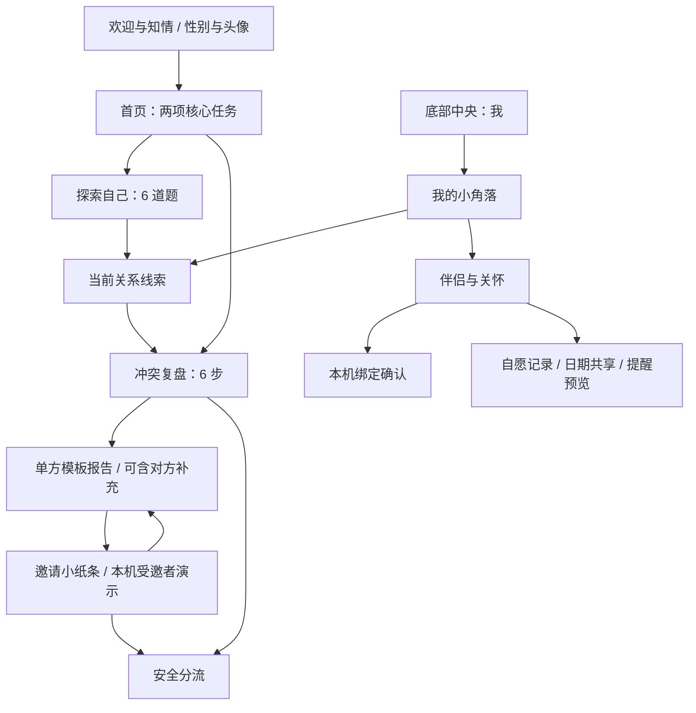

# 慢慢说 · 产品需求文档 V2

更新时间：2026-09-10  
文档状态：与当前 HTML 原型同步；正式服务能力另列为待实现要求  
基准文件：[relationship-mini-program-prototype.html](relationship-mini-program-prototype.html)，2026-09-10 08:17 更新  
配套文档：[Design Spec](DESIGN_SPEC.md)、[Tech Spec](TECH_SPEC.md)  
产品形态：面向微信小程序的单文件 Web 可用性测试原型，尚未实现微信登录、云端协作、真实 AI 或通知服务

## 1. 产品定位与原则

暂用名称为“慢慢说”。帮助成年亲密关系用户从自己的经历出发，整理事实、解释、感受、需要和下一步行动；在对方愿意参与时，分别保留双方说法。正式品牌名仍待确认。

首页只呈现“探索自己”和“冲突复盘”两项核心任务。“我的”承载个人选择、关系画像、历史、授权、伴侣与关怀、导出和删除。

产品原则：

1. 用温柔、具体的提问支持表达，不判输赢，不输出责任百分比、人格诊断或关系预测。
2. 感受可以被听见，叙述仍需标注来源；两段说法不自动构成共同事实。
3. 单方整理不替未参与者猜测心理或确定责任；不能为了对称而淡化具体伤害。
4. 参与、绑定、保存敏感记录、共享日期和接收提醒分别确认。
5. 高风险优先停止普通复盘，不要求用户急着和好或双方各退一步。
6. 经期关怀只记录本人自述和手填日期，不判断激素水平，不用它解释争执或否定感受，也不进入 AI 复盘。
7. 演示能力如实标注；本机页面隔离不等于真实账号权限或绝对私密。

目标用户为 18 岁及以上、希望了解自身反应或整理亲密关系冲突的人。单人即可使用，探索与复盘不以伴侣绑定或填写身体记录为前提。未成年人不进入正式服务；紧急危险场景转向现实安全支持。

## 2. 本次版本变化

| 8 月 24 日草案 | 当前 V2 基线 |
|---|---|
| “关系成长小程序 / AI 审判庭”概念包装 | 暂用品牌“慢慢说”，小动物陪伴和暖米色、陶土色界面 |
| 首页 / 复盘 / 我的底部 Tab | 底部“探索自己 / 我 / 冲突复盘”，首页保留双入口 |
| 五维 Likert 题组、确定性评分和 AI 解释 | 6 道选择题、最多 3 项关系需要，按回答拼接当前线索，无维度评分 |
| 创建、陈述、邀请、共同确认等独立页面 | 六步复盘表单，优先完成单方整理，对方补充可选 |
| 双方提交后生成共同报告 | 本机受邀者演示；提交后仍为单方报告，补充内容标注来源 |
| 独立历史、修复、回顾、设置页面 | 修复与反馈内嵌报告，当前记录摘要和数据操作集中于“我的” |
| 粉色主视觉和通用用户头像 | OKLch 暖色体系，可选性别和四种 CSS 小动物头像 |
| 无身体关怀模块 | “我的 → 伴侣与关怀”，包含双方绑定、日期共享、接收偏好和提醒预览 |

本次同步以最新 HTML 为依据，不沿用 `demo v1.html` 的旧流程。旧版中的生产能力没有因展示原型而自动完成，见第 10、11 节。

## 3. 范围与完成度

| 模块 | 当前原型可做 | 正式服务仍需实现 |
|---|---|---|
| 初次使用 | 性别/头像选择、成年人及隐私说明合并勾选、本机记忆 | 微信登录、可阅读的完整协议、协议版本与独立身份校验 |
| 探索自己 | 5 道单选 + 1 道需要多选，保存回答，展示线索卡 | 完整性约束、版本化问卷；如后续引入评分再单独设计与验证 |
| 冲突复盘 | 六步填写、保存草稿、模板报告、失败状态演示 | 多事件存储、稳健自动保存、服务端 AI 任务 |
| 对方视角 | 本机选填补充、来源标记、邀请小纸条、受邀者提交演示 | 跨设备邀请、身份验证、服务端访问控制、共同报告确认 |
| 修复与反馈 | 三条固定行动的选择/完成状态、反馈控件 | 可编辑行动、回顾日期和历史；反馈持久化 |
| 我的 | 修改头像/性别、当前事件与线索摘要、授权按钮、删除弹窗 | 完整历史列表、字段级授权、可下载导出、完整删除 |
| 伴侣与关怀 | 本机双向确认、日期记录/共享、接收偏好、到期预览 | 真实双账号绑定、授权执行、后台调度和通知 |
| 安全 | 用户主动勾选风险后分流 | 输入安全预检、输出复核、服务端阻断与地区支持资源 |

当前不包含聊天截图/OCR、语音视频分析、偷偷上传完整聊天记录、社区投票、排行榜、匹配度或分手概率、医学预测、付费订阅。

## 4. 信息架构与页面

| HTML 页面 ID | 页面职责 |
|---|---|
| `welcome` | 初次说明、性别与头像、成年人及使用说明确认 |
| `home` | 两项核心任务、草稿续写入口、模板演示提示 |
| `self-quiz` | 逐题选择与校验 |
| `self-result` | 需要、反应、可尝试行动与回答来源说明 |
| `create-review` | 六步表单及可选对方补充 |
| `report` | 空、等待、生成中、失败、单方结果及四个分区 |
| `invited-person` | 分享摘要确认、受邀者填写、拒绝和安全分流 |
| `safety` | 安全退出、仅存本机、删除入口 |
| `mine` | 个人设置、关系画像、摘要记录、授权及数据操作 |
| `companion` | 双方绑定、经期关怀、共享与提醒状态 |

桌面左右说明栏是原型评审辅助，不属于小程序页面。底部任务栏在欢迎页和受邀者演示中隐藏；其他页面可切换核心任务。二级页面用应用内“返回”；当前不使用浏览器路由。

## 5. 探索自己与个人选择

### 5.1 性别与头像

欢迎页和“我的”共用选择器，修改后同步显示并保存在当前浏览器。

| 字段 | 选项 | 默认 |
|---|---|---|
| 性别 | 男生、女生、其他、暂不透露 | 暂不透露 |
| 头像 | 小狗、小猫、小兔、小熊 | 小狗 |

性别不是必填判断条件，不决定题目、责任判断或能否使用经期关怀。头像只用于个人展示；事件邀请只分享当次确认的头像快照，不自动分享性别。

### 5.2 六题流程

| 顺序 | ID | 内容 | 选择方式 |
|---|---|---|---|
| 1 | `late_reply` | 对方未及时回应时的反应 | 四选一 |
| 2 | `space` | 如何表达空间需要 | 四选一 |
| 3 | `conflict_heat` | 争执激烈时的反应 | 四选一 |
| 4 | `fact_interpretation` | 能否区分事实与解释 | 四选一 |
| 5 | `repair_request` | 能否提出具体下一步 | 四选一 |
| 6 | `needs` | 当前关系需要 | 至少 1 项、最多 3 项 |

需要选项：被回应、被尊重、安全感、空间、稳定承诺、被理解、公平分担。

选择即保存，用户点击“下一步”才进入下一题；未选不可继续，可返回修改。最后点击“生成当前线索”。刷新会保留回答，但当前题号未持久化，会从第一题开始。

结果按“现在更在意这些 / 哪些时刻心里会一紧 / 争执时说自己会这样 / 可以先试试的一小步 / 这些发现从哪里来”呈现。当前主要展示需要和 `conflict_heat` 回答，其余卡片含固定提示；来源计数为单选回答数加已选需要数，不是得分或可信度。

结果页可进入复盘，但尚未把探索结果自动写入复盘输入，也没有按字段授权控件。未完成问卷也能通过“我的”等入口查看含占位提示的结果页，正式完成态需补充。

## 6. 冲突复盘与对方参与

### 6.1 六步表单

| 步骤 | 字段 | 校验与行为 |
|---|---|---|
| 事件信息 | `title`、`date` | 两项必填；发生时间目前为自由文本 |
| 我的视角 | `fact`、`interpretation` | 可观察事实、我的解释分别必填 |
| 感受与需要 | `feeling`、`need` | 两项自由文本必填 |
| 希望解决的问题 | `understand`、`adjust`、`next` | 希望对方理解、我愿意调整、本次下一步，三项必填 |
| 安全确认 | `risks` | 至少选一项；“以上都没有”与风险项互斥 |
| AI 复盘 | 可选 `partner.fact/feeling/need/source` | 补充可留空；再次校验前九项及安全确认后生成 |

原型没有主题标签、关系角色、情绪强度、日期时间选择器或独立行为证据输入项，不能按旧版字段验收。

“先存下来，歇一会儿”允许保存未完成内容并回到首页，首页改为“继续草稿”。上一步/下一步会收集当前输入；通过底栏或通用返回离开时未统一自动保存，不能承诺所有退出路径都保留最新文字。

### 6.2 直接补充对方视角

第六步折叠区可填写对方的事件说法、感受和需要，来源二选一：

- `retold`：由我转述，尚需对方确认，默认选项。
- `partner`：由对方本人在本机填写，原型不验证身份。

两种来源都需在“分歧说法”区可见。选择本人填写也不升级为已核实事实或共同报告。风险勾选立即停止普通复盘。

### 6.3 邀请小纸条与受邀者演示

入口位于已就绪报告：“邀请小纸条 / 受邀者演示”。这是一次事件的参与邀请，与长期伴侣绑定互相独立。

1. 发起者填写称呼（最多 30 字符）、愿意分享的主题（最多 120 字符）、选填留言（最多 1000 字符）。
2. 明确勾选分享称呼、当前头像、主题和留言。不分享完整陈述、性别、关系画像与历史。
3. 生成 48 小时有效的本机邀请状态，不发送消息或生成真实跨设备链接。
4. 受邀者看到经授权摘要；填写事实、感受、需要三段话，每项最多 4000 字符。
5. 提交必须补齐三段话、选择无风险、确认已成年并同意用于本次复盘。可先存草稿或拒绝。
6. 草稿不进入报告；提交后补充进入“分歧说法”，发起者会看到这三段内容。报告仍为单方，不经过真正的双方确认。
7. 拒绝会清除该邀请的未提交草稿；撤回、过期或拒绝后的旧邀请不能继续提交，可重新准备小纸条。
8. 受邀者确认风险后阻断普通复盘，可保留本机草稿、删除自己的补充或退出。

受邀者模式隐藏任务栏并阻止普通页面跳转，仅是界面层隔离；同一浏览器仍保存双方内容，没有账号权限保障。

### 6.4 报告、行动与反馈

生成成功约 800ms 后显示本地模板。支持空报告、生成中、模拟生成失败、模拟结构校验失败、等待邀请、撤回、过期、拒绝等状态；失败保留输入并提供重试。

| 分区标签 / ID | 当前显示内容 |
|---|---|
| 共识事实 / `consensus` | 范围说明、事件回顾、单方可观察事实；标签仍沿用旧称，正文不确认共同事实 |
| 分歧说法 / `difference` | 我的解释、对方补充及来源、尚未确认部分 |
| 互动循环 / `loop` | 我陈述的感受与需要、反思问题、固定的升级/缓和示例 |
| 修复行动 / `repair` | 我愿意调整的部分、三条固定行动、沟通表达草稿、反馈 |

行动支持勾选与完成/未完成切换，并保存在浏览器；“修改行动”只提示重新勾选，没有文字编辑或提醒日期。当前没有独立后续回顾页。

反馈按钮为“有帮助”“基本公平”，另有文本框；反馈只在当前内存状态中保存，刷新会丢失，尚未提交到服务端。报告中的固定示例不可当作从输入中识别出的证据。

## 7. 我的、伴侣与关怀

### 7.1 我的小角落

页面包含性别与头像、伴侣与关怀入口、关系画像入口、当前事件与线索摘要、邀请撤回/标记过期、导出与删除。历史目前仅有两行摘要，不支持多事件列表、筛选或长期趋势。

导出按钮只显示“尚未生成可下载文件”的提示。彻底删除使用二次确认弹窗，但实际清除范围存在缺口，见第 10 节。

### 7.2 双方绑定

1. 发起方填写双方称呼并确认成年人及绑定意愿，状态从 `none` 到 `pending`。
2. 模拟对方同意后成为 `bound`；拒绝或发起方撤回回到 `none`。
3. 绑定成功默认不共享经期日期，也不接收提醒；两个开关都需后续分别操作。
4. 解绑需二次确认，清空绑定和接收偏好，关闭日期共享与后续提醒，保留自己的身体记录。
5. 绑定不自动授权事件原始陈述、历史、画像或身体数据；已被对方看过的信息无法收回。

当前以本机称呼模拟双方，没有真实账号、身份验证或跨设备关联。

### 7.3 自愿身体记录

所有用户均可在“伴侣与关怀”中选择是否记录，不按性别显示或隐藏。

| 字段 | 可选值 / 校验 |
|---|---|
| `observation` | `skip` 先跳过、`yes` 有一点、`unsure` 不确定、`no` 暂时没有 |
| `last` | 最近一次经期开始日期；记录时必填，必须是真实有效日期且不晚于今天 |
| `next` | 本人预计下次日期，选填；如填写，须晚于 `last` 且不早于今天 |
| `lead` | 当天或提前 1、2、3、5、7 天；默认提前 3 天 |
| `message` | 多关心、耐心倾听、询问陪伴需求三种固定话语 |
| `local` | 明确同意敏感记录保存在当前浏览器，保存日期前必须勾选 |
| `share` | 与已绑定伴侣分享日期并准备提醒，默认关闭 |

只有 `yes/unsure` 展开日期与授权字段。选择 `skip/no` 并保存会关闭共享及提醒、清除记录；已有日期时需要确认。由于不再授权存储时不会持久化 `cycleCare`，`no` 的回答刷新后也不会保留。

不自动预测下次日期、周期或医学结果。用户不填写预计日期也可记录最近日期并自主共享，但不会安排提醒。身体记录不写入探索结果、冲突报告、分析责任或性别判断。

### 7.4 日期共享与接收提醒

三层控制分别为：本人同意本机存储 `local`、本人开启日期共享 `share`、伴侣开启接收提醒 `binding.receivesCare`。绑定只建立关系状态，不替代任何一层确认。

| 情况 | 对方能看日期 | 可产生到期提醒 |
|---|---|---|
| 未绑定 / 未同意存储 / 未开启共享 | 否 | 否 |
| 已绑定且同意存储、共享、有最近日期 | 是 | 还需检查预计日期和接收偏好 |
| 无预计日期 | 是 | 否 |
| 伴侣关闭接收提醒 | 是 | 否 |
| 预计日期已过去 | 是 | 否；不自动推算下一周期 |
| 接收开启，今天距预计日为 0 到提前天数 | 是 | 本机显示进入提醒窗口 |

共享范围只有最近开始日期、预计下次日期和本人选定话语；`observation` 的回答不共享。关闭共享同时停止日期展示和后续提醒；仅关闭接收提醒不撤销日期可见性。

原型只在进入页面、更新设置或预览时检查日期，无后台定时或实际消息。“模拟到期提醒（不发送）”用于提前查看提醒内容，即使尚未到达窗口也可模拟，不能算作真实到期或发送成功。

提供“关闭经期共享与提醒”“删除身体记录与提醒”“解除绑定”三种操作。前者保留私有记录，第二种确认后清除身体记录与设置，第三种确认后保留私有记录并清除绑定。

## 8. 安全、同意与数据规则

安全确认四类：伤害或威胁、强迫或严重控制、跟踪或恐吓、自伤风险。任何风险与“以上都没有”互斥。发起方、直接补充或受邀者任一路径确认风险都应停止普通复盘。

当前安全页提供“安全退出”（回首页）、“仅存本机”“删除这次记录”。它不清理浏览器历史，没有独立资源列表，也不能自动识别自由文本中的危险。

数据规则：

1. 本地记录未加密，共用设备不保证私密；页面上“仅本人”等表达需与此边界同时说明。
2. 事件邀请和伴侣绑定必须区分；事件参与不自动绑定，绑定也不自动共享事件。
3. 原型未上传文本到模型供应商。接入真实服务前，需重新说明发送内容、目的与接收方。
4. 正式服务保留字段级画像授权、可撤回邀请、可导出本人数据、完整删除的要求；这些不是当前已实现能力。
5. 原始补充的可见范围需明确：当前受邀者同意后，三段原文会提供给发起者，不应再承诺“只看整理后的报告”。

## 9. 可用性验收

| 场景 | 预期 |
|---|---|
| 首次打开 | 正常入口显示欢迎页，未勾选时开始按钮禁用；评审快捷入口需与正式鉴权区分 |
| 首页导航 | 只有两项核心任务，底部中间头像进入“我的”，关怀为二级页面 |
| 个人选择 | 默认暂不透露/小狗，欢迎与我的同步，四种动物不影响功能权限 |
| 探索答题 | 前五题必须单选，最后至少一项且最多三项；不自动跳题 |
| 复盘填写 | 必填九项与安全项通过后才生成，允许未完成草稿 |
| 对方补充 | 选填、来源可见、不自动变成共同报告或事实 |
| 受邀者 | 仅见主动分享摘要；未提交不进入报告；过期/拒绝/撤回阻止旧邀请提交 |
| 风险选择 | 立即停止普通复盘，显示保存、退出或删除选项 |
| 模板报告 | 明确演示，四分区可切换，失败保留输入 |
| 绑定 | 双方都确认后完成；共享与接收提醒仍默认关闭 |
| 关怀记录 | 无同意不得保存日期；未来的最近日期、非法日期、倒序预计日期被拒绝 |
| 共享 / 接收 | 关闭接收仍可看已授权日期，关闭共享则都停止 |
| 提醒 | 无预计日、过期、未接收时不进入到期态；允许单独模拟预览，不发送 |
| 删除身体记录 / 解绑 | 二次确认，清除范围符合第 7 节，已看过的信息不能收回 |

以上为验收口径。本次以 HTML 源码核对，未完成最新版浏览器视觉或端到端验收。

## 10. 已知差距与待完善项

1. **删除范围不完整**：当前删除会移除主存储键并重置事件、补充、邀请、绑定和身体记录，但不清理独立同意键；内存中的头像、探索回答、需要、行动完成状态、反馈和 AI 状态也未全面重置。后续保存可能重新写回残留。安全页“删除这次记录”还会影响身体记录与绑定，弹窗没有说明这些范围。修复前不能验收为完整的单条或全部删除。
2. **导出未实现**：“我的”说明仍提到导出文件，但按钮仅提示演示，无下载。
3. **草稿与反馈缺口**：反馈和题号未持久化，部分离开表单路径不收集当前输入；历史也不是多记录管理。
4. **报告语义和状态缺口**：“共识事实”标签用于单方正文；保留的共同复盘标题分支不是可用能力。风险发生后禁止生成，但既有就绪报告尚未统一失效，所有入口都阻断的机制仍待完善。
5. **可用性缺口**：点击完成行动会重建报告并回到第一分区，标签选中态可能不同步；返回和部分小控件的最小高度设置低于 44px，实际点击区仍需核验和补足。
6. **展示与权限不同**：欢迎侧栏跳转和 `?state=agreed` 是测试入口，不能证明成年验证；本机邀请、绑定和存储均没有服务端权限。
7. **关怀文案边界**：页面开头的“会收到提前提醒”应与接收偏好、日期条件和本机模拟状态一致，正式能力启用前不能承诺推送。

## 11. 正式服务的后续要求

沿用微信小程序方向，具体供应商和部署方案待选型；此处为建设要求，不宣称已经完成。

1. 实现登录、年龄/协议确认、版本化同意记录和跨用户权限检查。
2. 将单份全局状态拆成用户、多个事件、分人陈述、邀请、报告、修复行动、绑定和关怀设置；数据结构见 Tech Spec。
3. 真实共同复盘需可验证的独立参与者、有效同意及生成确认；转述不能作为对方已提交或双方一致证据。
4. 接入服务端模型适配、结构化输出校验、安全预检/复核和失败重试。报告字段沿用 `analysisScope`、`sharedFacts`、`disputedAccounts`、`emotionsAndNeeds`、`escalationBehaviours`、`helpfulBehaviours`、`conflictCycle`、`responsibilityMap`、`repairPlan`、`conversationScript`、`followUpQuestions`、`safetyFlags`、`uncertainty`。
5. 安全与公平评估覆盖性别交换、叙述顺序交换、转述来源、不同伴侣组合和伤害证据，避免迎合或强行平衡。
6. 单独实现关怀授权和通知任务；每次发送前重新检查绑定、共享、接收偏好、日期窗口与撤销状态，身体记录不进入模型请求或普通日志。
7. 完成可下载导出、全链路删除、弱网与恢复、行动编辑和后续回顾。
8. 上线前确认正式名称、运营主体、服务地区、隐私条款、模型供应商与数据处理安排；如接入正式量表，再确认版本、适用性与许可。

## 12. 成功指标

原型尚无埋点，以下为后续评估指标，不是已有统计：探索完成率、复盘表单完成率、报告理解度、来源区分正确率、行动选择及回顾完成率、用户对帮助/公平/可执行性的反馈。

关怀模块重点观察用户是否理解“日期共享”和“接收提醒”的区别，以及能否自主跳过、关闭或删除；不以敏感记录填写率、绑定率或争吵次数增长作为成功目标。
