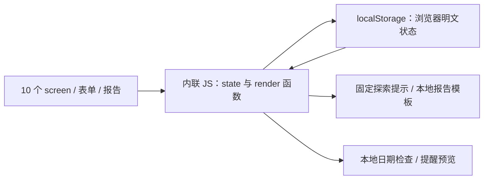
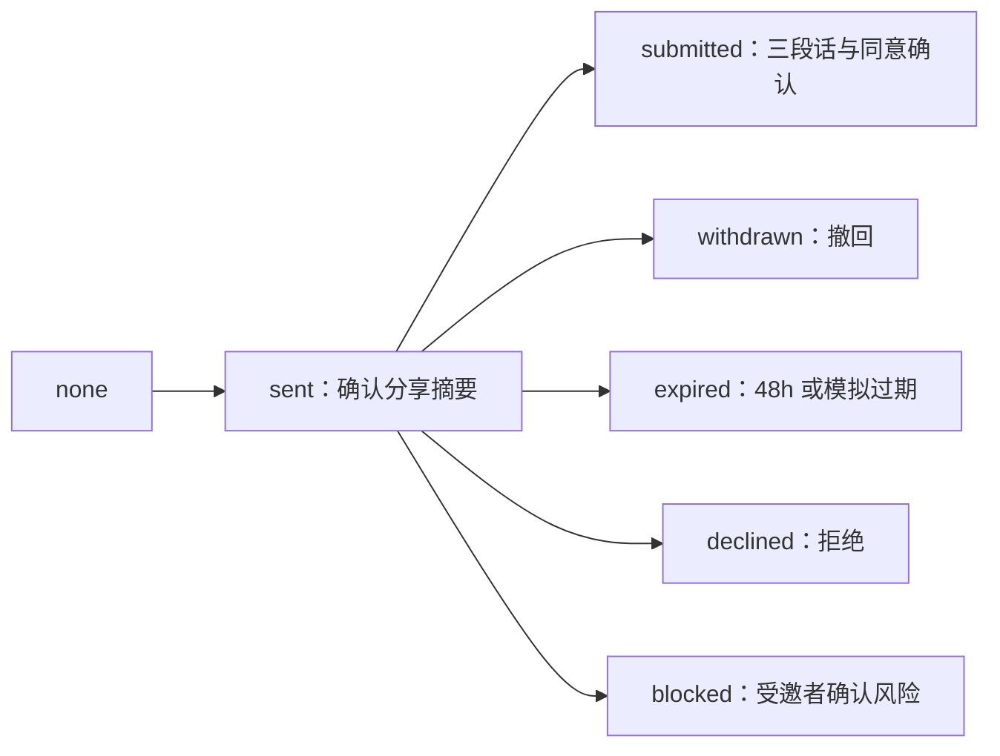
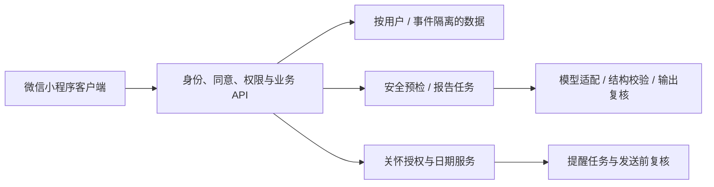

# 慢慢说 · Tech Spec V2

更新时间：2026-09-10  
文档状态：当前实现说明 + 正式服务待实现方案，二者分别标注  
基准：[relationship-mini-program-prototype.html](relationship-mini-program-prototype.html)，2026-09-10 08:17 更新  
配套：[PRD](PRD.md)、[Design Spec](DESIGN_SPEC.md)  
基准 HTML SHA-256：`20FE3848D550C4FD622CB1A2BACACC1B30853E4D5B41C21CDC922EE2AF65ED51`

## 1. 当前技术边界

当前是单个 HTML 文件：内联 CSS、原生 JavaScript、静态 DOM 和浏览器 `localStorage`。没有框架、构建步骤、后端 API、数据库、账号系统、模型调用、外部字体或通知 SDK。

“微信小程序 V2”表示目标形态及原型外观，不代表 WXML/WXSS、小程序登录或云开发已经实现。`demo v1.html` 是旧版本，不作为本次规格基准。



报告通过约 800ms 的定时器模拟生成，失败与结构校验失败由测试按钮指定状态。经期提醒只在页面交互时检查日期；没有关闭页面后的调度，也不发送消息。

## 2. 页面与渲染结构

页面 ID：`welcome`、`home`、`self-quiz`、`self-result`、`create-review`、`invited-person`、`report`、`safety`、`mine`、`companion`。

| 函数 / 对象 | 职责 |
|---|---|
| `showScreen()` / `screenHistory` | 切换 `.screen.active`，维护内存返回栈，按页面触发渲染 |
| `syncAppChrome()` | 控制返回、任务栏及选中态 |
| `renderProfileChoices()` / `syncAnimalAvatars()` | 性别/动物选择、按钮状态与 CSS 头像同步 |
| `renderQuiz()` / `canLeaveQuizStep()` | 6 道选择题，单选必答，需要项最多 3 个 |
| `renderSelfResult()` | 将需要、冲突反应和固定提示拼接为线索卡 |
| `renderReviewStep()` / `saveReviewStep()` | 六步表单展示和逐步收集/校验 |
| `beginReport()` / `renderReport()` | 检查输入、模拟生成、展示状态 |
| `renderReportPanels()` / `renderRepairList()` | 四分区模板、行动选择和完成状态 |
| `prepareInvitation()` / `renderRecipient()` | 事件邀请摘要确认、本机受邀者填写 |
| `renderBinding()` / `renderCompanion()` | 绑定状态、身体记录表单和关怀状态 |
| `dateDay()` / `careAvailability()` | 日期有效性、共享与提醒窗口判断 |
| `saveState()` / `loadState()` | 主状态序列化与读取 |

页面切换没有 URL 路由。`recipientMode` 为真时拒绝跳转到其他 screen，受邀者结束演示后解锁；这不是鉴权。首次进入检查独立同意键，`?state=agreed` 可作为原型快捷入口跳到首页；侧栏也能直接切页，正式服务不可沿用为年龄或同意保障。

## 3. 实际数据与持久化

### 3.1 原型状态结构

下列类型只是现有 JavaScript 的文档化描述，项目中没有 TypeScript 实现或运行时 Schema 验证。

```ts
type Gender = 'male' | 'female' | 'other' | 'private';
type Animal = 'dog' | 'cat' | 'rabbit' | 'bear';
type QuizKey = 'late_reply' | 'space' | 'conflict_heat'
  | 'fact_interpretation' | 'repair_request';
type PartnerInput = {
  fact: string;
  feeling: string;
  need: string;
  source: 'retold' | 'partner';
};
type ReviewInput = {
  title: string;
  date: string; // 自由文本，不是 datetime
  fact: string;
  interpretation: string;
  feeling: string;
  need: string;
  understand: string;
  adjust: string;
  next: string;
  risks: string[];
};
type LocalInvitation = {
  name: string;
  topic: string;
  animal: Animal; // 分享确认时的快照
  message: string;
  expiresAt: number; // Date.now() + 172800000
  draft: { fact: string; feeling: string; need: string };
};
type LocalBinding = {
  status: 'none' | 'pending' | 'bound';
  selfName: string;
  partnerName: string;
  receivesCare: boolean;
};
type CycleCare = {
  observation: 'skip' | 'yes' | 'unsure' | 'no';
  last: string; // YYYY-MM-DD，空字符串表示未填写
  next: string; // 手填预计日，可空，不自动计算
  lead: '0' | '1' | '2' | '3' | '5' | '7';
  message: 'gentle' | 'listen' | 'ask';
  local: boolean;
  share: boolean;
};
type RepairAction = {
  id: 'pause' | 'fact' | 'reply';
  text: string;
  selected: boolean;
  done: boolean;
};
```

默认值：`profile={gender:'private',animal:'dog'}`；`partner.source='retold'`；`binding.status='none'`、`receivesCare=false`；关怀 `observation='skip'`、`lead='3'`、`message='gentle'`、`local/share=false`。

### 3.2 两个存储键

| 存储键 | 内容 |
|---|---|
| `relationship-v2-consent` | 字符串 `'true'` 表示点击过欢迎页开始按钮；不含协议版本、时间或用户身份 |
| `relationship-v2-state` | 一份 JSON 快照，字段见下表 |

| 状态字段 | 是否写入主快照 | 备注 |
|---|---|---|
| `profile`、`partner` | 是 | 本机个人选择和对方补充 |
| `quizAnswers`、`needs` | 是 | 五题回答值为选项文本；需要为文本数组 |
| `reviewStep`、`review`、`draftSaved` | 是 | 单一事件，没有 eventId 或事件列表 |
| `reportMode`、`aiStatus` | 是 | 只存状态，没有独立报告内容快照 |
| `inviteStatus`、`invitation` | 是 | 单一邀请，未提交草稿也在同一浏览器 |
| `repairActions`、`binding` | 是 | 单组行动与一段本机关系 |
| `cycleCare` | 仅 `local=true` 时 | 否则值为 undefined，JSON 中省略整个字段 |
| `accepted` | 否 | 单独从 consent 键读取 |
| `quizIndex`、`feedback` | 否 | 调用 saveState 也不会持久化这两个字段 |
| `screenHistory`、`recipientMode` | 否 | 仅内存导航状态 |

存储未加密，不存在不同用户命名空间或真实账号隔离。不能把“对方页面没有展示”描述为“对方无法访问本机数据”。

`loadState()` 使用 `JSON.parse` 后浅层 `Object.assign`；解析异常有提示，但没有状态版本、深层默认值合并、枚举或数组类型校验。`saveState()` 的写入异常未捕获，同意键读取也没有异常保护。

初始化会将旧 `reportMode='joint'` 降为 `single`，将未结束的 `aiStatus='loading'` 改为 `failed`，并修正不在四种动物中的头像值。这不是完整数据迁移。

### 3.3 保存触发点

- 探索选择后立即保存回答；切题也调用保存，但题号不在序列化字段内。
- 复盘上一步、下一步、显式草稿保存会调用 `saveReviewStep()`；底栏或通用返回并不统一收集当前输入。
- 对方补充输入事件会保存；受邀者草稿通过“先存草稿”保存，未提交不写入 `partner`。
- 行动选择/完成、邀请状态、绑定与关怀设置变更会保存。
- 反馈虽触发 `saveState()`，但 `feedback` 被遗漏，刷新后丢失。
- “历史”是 `renderMine()` 由当前事件和需要生成的两行摘要，并非历史集合。

## 4. 探索与复盘实现

### 4.1 探索没有评分层

`quizQuestions` 共 6 题。前五题四选一，最后一题从七项需要中选 1–3 项；未回答不能通过下一步，不会选择后自动跳题。

`renderSelfResult()` 直接显示 `needs`、`quizAnswers.conflict_heat` 及固定提示；`sourceCount = Object.keys(quizAnswers).length + needs.length`，不能解释为维度分数或置信度。没有五维 Likert 评分、量表归一化、模型解释或字段级档案授权。

自我探索到复盘只是导航，当前报告模板不读取 `quizAnswers/needs` 作为分析输入。关系画像和问卷可继续作为 V2 功能，不以接入正式量表为前提。

### 4.2 复盘输入校验

生成前检查 `title/date/fact/interpretation/feeling/need/understand/adjust/next` 九项 trim 后非空，以及 `risks` 包含“以上都没有”。有任何其他风险值时跳安全页。

第一步的时间是字符串，未做日期解析。原型没有主题标签、关系角色、情绪强度或独立本人/对方行为字段；生产数据设计可以后续扩展，但不能将旧版字段说成已有表单。

补充字段选填，来源 `retold/partner` 都由当前页面选择，不构成身份验证。插入正文时，事件自由文本与对方补充通过 `escapeHtml()` 转义；其他来源如可被篡改的本地问卷值仍需统一校验与安全渲染。

### 4.3 报告状态与内容

| 状态字段 | 正常流程中的值 | 说明 |
|---|---|---|
| `reportMode` | `empty`、`single`、`waiting` | `joint` 仅剩旧分支，加载时降级，正常提交不进入 |
| `aiStatus` | `idle`、`loading`、`ready`、`failed`、`invalid` | 模拟 UI 状态，不是后端任务结果 |

`beginReport('single')` 校验输入后设 `loading`，约 800ms 后改 `ready`。`fail/invalid` 直接切模拟错误，不调用模型或 JSON 校验器。失败重试回到 single 生成路径。

`renderReportPanels()` 只有非 empty 且 ready 时返回内容，函数内 `joint=false`。四个面板为：

| DOM 面板 | 数据 / 模板来源 |
|---|---|
| `consensus` | 范围、标题、`review.fact`；显示单方可观察事实 |
| `difference` | `review.interpretation`、`partner` 三字段和来源 |
| `loop` | `review.feeling/need`、固定循环问题与行为示例 |
| `repair` | `review.adjust`、固定三条行动、由事实/感受/需要/理解/下一步拼接的沟通草稿、反馈 |

报告内容是动态派生的，没有 reportId、schemaVersion、inputHash 或不可变快照。补充修改后再次渲染即可变化，不能称为一次新模型生成或已确认的共同报告。

三个行动 ID 为 `pause/fact/reply`；初始前两项 selected、第三项未选，done 均为 false。“修改行动”只提示调整勾选，无文字编辑；完成标记可以切换，不设置 dueAt 或后续回顾。

## 5. 事件邀请与长期绑定

### 5.1 两种关系不能混用

`invitation/inviteStatus` 表示一次复盘的参与状态；`binding` 表示长期伴侣绑定演示。二者没有真实 userId，不互相自动授权；不绑定也可使用探索、复盘或事件邀请。

### 5.2 事件邀请

`inviteStatus` 的值为 `none/sent/submitted/withdrawn/expired/declined/blocked`。



准备小纸条需称呼、主题和分享勾选，保存当时头像、留言与 `expiresAt=Date.now()+172800000`。称呼/主题/留言的控件 maxlength 为 30/120/1000；没有服务端限制。

受邀者三段话 maxlength 均为 4000。提交需三项非空、安全选择为 safe、同意勾选有效且未过期；成功将 draft 复制到 `partner`，设置 `source='partner'`、`inviteStatus='submitted'`、`reportMode='single'`。没有双方最终确认页。

到期检查发生于渲染报告、渲染受邀页以及提交时；没有后台过期任务。拒绝清除邀请 draft；撤回/过期阻止继续提交，但不会自动清除所有既存草稿或已提交补充。

`recipientMode` 限制页面跳转，分享页面不展示发起方完整陈述、性别、画像与历史。所有数据仍在同一浏览器，结束演示按钮允许返回发起者；不得宣称真实权限隔离。

### 5.3 伴侣绑定

| 转换 | 条件 / 副作用 |
|---|---|
| `none → pending` | 双方称呼非空，发起者勾选成年人和意愿；`receivesCare=false` |
| `pending → bound` | 模拟对方勾选成年及同意；`receivesCare=false`、`cycleCare.share=false` |
| `pending → none` | 拒绝或发起者撤回，清空称呼和接收偏好 |
| `bound → none` | 确认解绑，清空 binding 并关闭 share；保留身体记录 |
| bound 下切换接收 | 只改变 `binding.receivesCare`，不改变日期共享权限 |

双方都由同一台设备模拟操作。绑定与接收偏好没有服务端执行、真实账号绑定或不可伪造的同意凭证。

## 6. 身体记录、共享与提醒

### 6.1 数据输入和保存

`observation=yes/unsure` 才展开字段，选项与性别无关。日期保存要求：

1. `last` 为有效 `YYYY-MM-DD`，且不晚于本地今天。
2. `next` 可空；填写时必须有效、晚于 last、且不早于今天。
3. `local=true`，否则提示先确认本机敏感存储说明。
4. `share=true` 时必须 bound；日期共享默认关闭。
5. lead 必须属于 `0/1/2/3/5/7`，message 必须存在于 `careMessages`。

保存 `skip/no` 会重置 CycleCare，若已有 last 则先确认删除；因为 local=false 整个对象不会持久化，no 的选择只在当次内存保留。

`dateDay()` 先匹配日期格式，再构造 UTC 中午时间，通过 ISO 日期回写一致性排除不存在日期，以毫秒除 86400000 得到可相减的日值。`localDateText()` 使用浏览器本地年月日表示今天；最终生产时区规则仍需明确。

### 6.2 可见与到期条件

`careAvailability(today)` 返回 `{shared, due, text}`。合法存储状态下：

```text
shared = binding.status == bound
         AND cycleCare.local
         AND cycleCare.share
         AND cycleCare.last 非空

remaining = dateDay(cycleCare.next) - dateDay(today)
due = shared
      AND next 存在且可计算
      AND binding.receivesCare
      AND 0 <= remaining <= Number(cycleCare.lead)
```

检查顺序为未绑定 → 未共享 → 无预计日 → 非法预计日 → 已过期 → 未接收 → 到期窗口。共享函数本身只检查 last 非空，不重复执行保存时的全部日期校验，不能当作可防止存储篡改的安全边界。

共享 payload 的业务范围为 `last/next/选定话语`；预览还显示分享者称呼。观察回答 observation 不共享，身体记录不输入探索结果或报告模板，未来也必须排除出模型请求。

关怀关闭行为：

| 操作 | 记录 | 日期可见 | 后续提醒 |
|---|---|---|---|
| 伴侣关闭 receivesCare | 保留 | 仍按 share 授权可见 | 停止 |
| 本人关闭 share | 保留 | 停止 | 停止 |
| 解绑 | 保留本人记录，清空绑定 | 停止 | 停止 |
| 删除身体记录 | 重置 CycleCare，主存储中省略该字段 | 停止 | 停止；绑定及其接收偏好保留 |

`previewCare` 只在 shared 时显示日期卡。若 next 未过期且伴侣接收已开，会出现“模拟到期提醒（不发送）”；此按钮不要求 remaining 已在提前窗口内，是内容预览，不是真实到期执行。点击时重新检查共享和接收状态，但没有后台调度、发送记录或去重。

## 7. 安全与数据操作现状

### 7.1 风险处理

风险来自主动勾选，没有关键词预检、模型分类或文本安全服务。四类选项与“以上都没有”互斥；发起方和补充风险进入安全页，受邀风险设 `inviteStatus=blocked`、`aiStatus=idle` 并留在受邀者安全区域。

`beginReport()` 和 `openInvitation()` 会再次检查已有风险。但普通 `showScreen('report')` 与 `renderReportPanels()` 不统一检查风险，发起方选择风险时也没有总是作废既有 ready 状态，仍可能通过其他入口看到旧报告。正式“停止普通复盘”必须覆盖生成、已生成报告访问、邀请和异步任务回写。

“安全退出”只导航回首页；“仅存本机”调用保存；不擦除浏览器历史、不发送外部联系请求。

### 7.2 导出与删除

导出仅 Toast，不生成 Blob、文件或下载。不得把演示文案当作导出成功。

`confirmDelete` 实际执行：删除主状态键，重置 review、partner、reviewStep、draftSaved、reportMode、inviteStatus、invitation、binding、cycleCare，然后回首页。

当前未完整重置：`profile`、`quizAnswers`、`quizIndex`、`needs`、`repairActions`、`feedback`、`aiStatus`、独立 consent 键及部分 UI/导航状态。内存残留可能被后续 `saveState()` 写回。生成定时器没有取消句柄，也可能在删除后完成回调并再次保存。

安全页的“删除这次记录”与“我的彻底删除”使用相同处理，会同时清除绑定和身体记录；弹窗只描述事件相关内容，范围不一致。修复前不能宣称完整删除或精确的单条删除。

## 8. 原型优先完善清单

本次只同步文档，下表是待实现工作，不表示 HTML 已修复。

| 优先项 | 建议实现 / 验收依据 |
|---|---|
| 删除范围和残留 | 分离事件删除、身体记录删除、全部删除；统一初始状态工厂；取消异步任务；按确认范围移除存储和内存并核验刷新及再次保存 |
| 安全状态绕过与回写 | 生成、渲染、邀请和回调统一检查事件安全状态及版本；风险后使旧报告不可访问或转安全说明 |
| 数据恢复 | 引入存储版本、深层默认值和结构校验；捕获读写异常，不虚报保存成功 |
| 草稿和反馈 | 明确保存策略，补齐切页/返回保存；反馈、题号是否持久化按 PRD 实现 |
| 历史与报告一致性 | 多事件 id、按事件隔离状态、报告输入快照；历史状态区别失败/等待/完成 |
| 报告事件处理 | 当前每次渲染会给固定 Tab 重复绑定监听；改为单次绑定或事件委托，并保持当前分区与 aria-selected 一致 |
| 原型文案 | 单方“共识事实”、导出、共享后提醒等表述与能力一致；正式版本移除模拟测试入口 |
| 触控和可访问性 | 核验 44px 点击区、Tab 键盘、焦点管理、长文及移动端布局 |

## 9. 正式服务架构方向（待实现）

延续旧稿的微信小程序方向，客户端 + 服务端 + 数据库 + 模型适配层作为待选型方案；云开发或自建后端尚未确定。本次没有核验外部平台最新 API、报价或合规条件，不能将本节视为已确认供应商能力。



客户端不保管模型密钥，不直接调用模型供应商。服务端执行身份校验、字段授权、安全检查、数据存取和任务取消；关怀与模型请求组装分离，默认不给 AI 读取身体记录的能力。

### 9.1 目标数据对象

以下对象尚未落地，用于从单份浏览器状态迁移；旧稿字段若保留，必须与新表单映射，不凭空补造用户答案。

| 对象 | 最少内容与约束 |
|---|---|
| User | id、登录身份关联、年龄确认、协议版本/时间、个人性别/头像选择 |
| SelfProfile | userId、questionnaireVersion、answers、needs、resultVersion；当前无 scores；结果默认私有 |
| ConflictEvent | id、creatorId、title、occurredAtText、status、version；先保留自由时间文本，结构化日期需用户明确输入 |
| Statement | id、eventId、authorUserId、source、事实/解释/感受/需要/希望理解/愿意调整/下一步、提交版本；转述单独标记 |
| EventInvitation | id、eventId、授权摘要快照、邀请凭证摘要、expiresAt、status、参与者与提交记录 |
| ConsentRecord | userId、eventId 或 relationId、purpose、grantedFields、version、grantedAt、revokedAt；明确授权对象和范围 |
| PartnerRelation | id、双方 userId、双方同意时间、状态、撤回时间；区别于一次事件邀请 |
| CycleCareRecord | ownerUserId、observation、last、next、版本；敏感字段默认本人可读，不自动推算 |
| CareShareGrant | ownerUserId、relationId、recipientUserId、允许字段、有效版本、撤销状态 |
| CareReceivePreference | recipientUserId、relationId、是否接收；与字段共享授权独立 |
| CareReminderJob | relationId、记录/授权版本、目标日期、提前天数、时区、状态、去重键；发送前复核 |
| AIReport | id、eventId、reportType、inputHash、schemaVersion、status、content、创建时间；对输入版本绑定 |
| RepairAction / FollowUp | eventId、ownerUserId、行动内容、状态、可选 dueAt、回顾记录；本人自主选择 |
| Feedback | reportId、userId、类型、备注、创建时间，真实持久化 |
| ExportJob / DeleteJob | ownerUserId、确认范围、任务状态、完成/失败记录；未完成不返回成功结论 |

### 9.2 权限与邀请规则

1. 所有记录查询与写入按真实身份在服务端校验；同设备称呼和 source 选择不构成授权。
2. 邀请接受前只返回经确认的摘要。受邀者草稿仅本人可读，提交后按其同意范围向发起者开放。
3. 单方转述始终保留 provenance，不能变成对方本人陈述。真正共同报告需双方已验证身份、独立提交、有效授权及生成确认。
4. 邀请撤回、过期、拒绝后拒绝新提交；原始补充及已生成报告如何处理需明确记录级策略，不把撤回邀请误作删除全部历史。
5. 绑定不自动授权探索档案、事件、身体日期。经期读取只返回共享字段，观察回答排除；关闭接收提醒不改变字段可见权。
6. 解绑、关闭共享、删除记录时取消对应待发送任务；并发发送前重新检查关系/授权/记录版本，防止旧任务继续发出。

## 10. 真实 AI 报告契约（待实现）

流程：校验登录及事件访问 → 加载当前版本陈述和授权 → 风险预检 → 组装最小模型输入 → 调用模型 → Schema 校验和输出复核 → 保存报告及状态。结构失败按旧稿要求最多自动修复/重试一次，再返回明确失败；前端不展示未校验内容。

模型输入不包含动物头像、用于偏见判断的性别或身体记录。探索档案如后续确需引用，必须本人为当次事件按字段授权，当前原型并未实现此能力。

沿用 PRD 的 13 个顶层字段，以下仅为合同示例，不是已接入 Schema：

```json
{
  "analysisScope": {
    "mode": "solo_self_review",
    "limitations": ["以本人陈述为主，补充来源单独标记"],
    "informationCompleteness": "partial"
  },
  "sharedFacts": [],
  "disputedAccounts": [],
  "emotionsAndNeeds": [],
  "escalationBehaviours": [],
  "helpfulBehaviours": [],
  "conflictCycle": { "summary": "", "steps": [] },
  "responsibilityMap": { "creator": [], "partner": [], "jointQuestions": [] },
  "repairPlan": [],
  "conversationScript": [],
  "followUpQuestions": [],
  "safetyFlags": [],
  "uncertainty": []
}
```

| 字段组 | 服务端约束与界面映射 |
|---|---|
| analysisScope / uncertainty | 模式、来源完整性及局限必须可见；单方模式禁止伪造另一方已确认 |
| sharedFacts / disputedAccounts | 只把双方明确一致的陈述列为双方共识，仍不宣称外部核实；附 statementId/版本/来源引用；单方 sharedFacts 留空，本人事实从其原始陈述显示 |
| emotionsAndNeeds | 本人自述与推测分开，标注来源，映射互动分区 |
| escalationBehaviours / helpfulBehaviours | 具体文本或行为引用与可能影响分开，不把固定模板示例当证据 |
| conflictCycle | 证据不足时保留不确定性，不强行套追问/回避模式 |
| responsibilityMap | 只列具体行为，单方不得定论未参与者责任，不给比例 |
| repairPlan / conversationScript / followUpQuestions | 映射修复分区，行动由用户选择；高风险不输出普通调解计划 |
| safetyFlags | 由安全流程决定是否阻断，不能只作为普通报告里的附注 |

输出不得出现胜败、人格/疾病/依恋类型诊断、关系预测或性别责任刻板判断。保留自研选择题的非诊断定位；若将来接入确定性量表评分，需独立版本、规则测试与许可核验，AI 不自行给分。

## 11. 生产安全、提醒与数据生命周期（待实现）

安全流程结合用户筛查、规则与模型检查；沿用 L0 普通冲突、L1 升级风险、L2 高风险、L3 紧急风险的规划。L2/L3 停止普通调解，转向地区适配的现实支持信息；当前 HTML 没有实现分级分类器。

提醒任务以本人手填预计日和提前天数为依据，不自动推算下一周期。服务端时区、发送时刻、通知渠道和去重规则需在接入时确认；不能把页面 `remaining <= lead` 直接用作循环群发条件。

每次发送前检查绑定有效、存储/处理授权、共享授权、接收偏好、记录未删除、预计日未过期、目标任务版本及去重记录。渠道许可撤回、关闭共享、解绑或删除均应使后续任务停止；日期内容与可见范围由本人授权，已阅读信息不能技术性收回。

隐私要求：传输加密、密钥仅服务端、敏感文本不进普通日志、最少采集、按目的隔离数据；导出需确认范围，默认不带未授权的对方草稿。删除需覆盖原始输入、派生报告、授权与提醒任务、缓存和既定备份生命周期，返回可追踪的任务状态。

产品名称、运营主体、服务地区、数据保留期限、模型/云服务供应商、协议和地区支持资源仍需上线前确认。当前文档没有宣称完成法律、医学或平台审核。

## 12. 验证范围与后续测试

本次同步采用源码核对、文档字段/页面/颜色一致性检查及文件完整性检查；未对最新版进行浏览器视觉验收，也未执行端到端产品测试。[critique.json](critique.json) 的既有测试记录属于此前原型制作过程，不能替代本次验证。

后续原型测试重点：六题校验与 3 项上限、六步必填与保存、补充来源、邀请过期/撤回/拒绝/提交、风险阻断所有入口、完整删除后刷新和再保存、报告分区重绘、反馈保存。

关怀测试应覆盖未绑定、未同意存储、未共享、未开启接收、无预计日、非法/倒序/未来最近日期、到期边界、过期日期、关闭共享、解绑与单独删除；区分真实到期状态和提前模拟预览。

正式服务另需权限越权、双方确认、撤销与并发发送、报告 Schema、安全及公平性测试。性别或叙述顺序交换不应系统性改变行为判断；包含明确伤害时不能以公平为由淡化。网络失败、任务超时与删除未完成都必须可恢复并如实显示。
