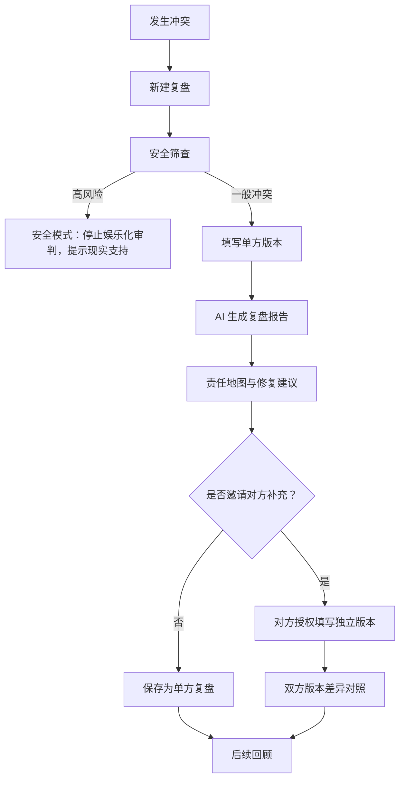

# 恋爱吵架记录与复盘小程序：竞品分析与心理学理论调研

访问日期：2026-08-16；国内与自我探索竞品补充访问日期：2026-08-24  
当前阶段：研究、产品判断、文档输出。未修改业务代码，未制作页面或视觉稿。

## 1. 执行摘要

建议的产品定位不是“AI 判谁赢”，而是“冲突后的结构化关系复盘工具”：用轻量、可传播的“AI 审判庭”包装吸引用户进入，但真实结果应采用“行为证据 + 双方需求 + 互动循环 + 各自可承担责任 + 修复行动”的责任地图/关系教练混合模式。

主要判断：

1. 第二阶段产品方向调整为两个核心模块：“认识自己”和“一起复盘”。“认识自己”以单人私密自我探索为主；“一起复盘”以情侣双方共同参与为主。单方复盘仍保留为降级路径，但必须醒目标明信息局限。
2. 不建议第一版做精确责任百分比、人格/依恋诊断、谁胜诉谁败诉的最终裁决。竞品 Clarity AI Conflict Coach 虽然强调“receipts”“tactics”“who owned what”，但其隐私政策也明确 AI 输出可能不准确且不是诊断或法律判断。Still Here 更谨慎：Tone Check 不判断谁对谁错，只做用词反馈和冲突后柔性连接。
3. 适合 MVP 的理论机制包括：NVC 的观察-感受-需要-请求结构、CBT 思维记录/认知重评、Gottman 的批评/蔑视/防御/筑墙与修复尝试、追逐-退缩/要求-退缩模式、情绪淹没与暂停修复。成人依恋和 EFT 可作为“长期互动模式解释”的参考，但不应在单次记录中给用户贴固定类型标签。
4. 安全边界必须前置。一般情侣冲突可以讨论双方行为；但如果出现身体暴力、性强迫、威胁、跟踪、监控、财务控制、自伤或紧急危险，产品应退出娱乐化“审判”，转为安全提示、支持网络和线下专业资源引导，不能机械地“双方各打五十大板”。
5. 市场机会不应表述为“国内完全空白”。2026-08-24 补充核验显示，国内已出现“情侣吵架AI判官”“魔镜智析”等更接近的 AI 情感/冲突分析产品，也有恋爱记、小恩爱、微爱等成熟情侣空间产品，以及 KnowYourself、壹心理、Attached、心译等自我探索/依恋产品。更准确的机会判断是：现有产品分别覆盖“娱乐评理/聊天截图分析/情侣记录/心理测评”，但较少把“自我探索档案、双方独立陈述、行为证据、责任地图、隐私授权和高风险分流”整合成一个克制的关系成长闭环。

推荐 MVP 结果结构：

1. 事实时间线：只基于用户输入，标注“已陈述事实/个人解释/缺失信息”。
2. 情绪与需要：把攻击性表达翻译为感受、担心、需求和请求。
3. 升级行为证据：指出具体句子或行为如何导致升级，例如批评、蔑视、防御、筑墙、读心、绝对化。
4. 责任地图：不按百分比判输赢，而是分别列“我可以负责的行为”“对方若愿意可反思的行为”“需要双方一起确认的争议点”。
5. 修复行动：冷静期、道歉要素、下一次对话话术、一个小承诺、回顾提醒。
6. 安全分流：高风险内容触发时优先显示安全提示和现实支持，不继续生成娱乐化判决。

## 2. 当前产品需求盘点

### 2.1 当前项目目录盘点

只读检查结果：

| 项目 | 结果 |
|---|---|
| 当前目录 | `C:\Users\40624\Documents\ChatGPT\恋爱复盘` |
| 已有文件 | 未发现已有产品说明、PRD、原型、代码或笔记；只发现 `.git` |
| `docs` 目录 | 原本不存在，本次为交付报告新建 |
| 现有实现 | 无法确认/未发现 |
| 现有 PRD 或原型 | 无法确认/未发现 |
| 本次修改 | 仅新增本研究报告 |

### 2.2 用户已提出的初始设想

已明确来自需求描述，但尚未等同于已实现功能：

1. 记录每次吵架日期。
2. 记录起因、经过、双方说过或做过的事。
3. 保存历史吵架记录。
4. 使用 AI 分析吵架内容。
5. 候选包装为“AI 审判”。
6. 希望接入可靠亲密关系心理学理论。
7. 目标从“记录一次吵架”走向“理解互动模式、承担责任、形成修复方案、减少重复冲突”。

### 2.3 已明确需求、未决问题和研究假设

| 类型 | 内容 | 当前判断 |
|---|---|---|
| 已明确 | 产品面向情侣或恋爱中个体 | 成立 |
| 已明确 | 视觉方向为粉色、温柔、浪漫但不过度幼稚 | 后续视觉阶段再验证 |
| 已明确 | 当前只做研究和文档，不开发页面 | 已遵守 |
| 已调整 | 单人复盘还是双方共同使用 | 第二阶段建议：“认识自己”单人私密优先；“一起复盘”双人共同参与优先；单方复盘作为降级路径 |
| 未决 | “AI 审判”是否真的判输赢 | 建议作为入口包装，不做最终胜负裁决 |
| 未决 | 接入哪些理论 | MVP 选 NVC、CBT、Gottman、要求-退缩、情绪调节；依恋/EFT 暂做解释层 |
| 未决 | 高风险内容处理 | 必须做安全分流 |
| 假设 | 用户愿意在情绪激烈后填写结构化字段 | 需访谈验证 |
| 假设 | “审判庭”概念有传播性但不损害信任 | 需 A/B 文案测试 |
| 假设 | 双方版本对照能提高公平感 | 需原型测试 |

## 3. 竞品选择标准

选择标准：

1. 与“亲密关系冲突记录/修复”任务链有关，而不只是泛情侣娱乐。
2. 覆盖单人、双人、AI、非 AI、心理自助、线下替代方案。
3. 能找到官网、App Store、隐私政策、帮助中心或官方说明。
4. 能观察输入、输出、隐私、安全或收费机制。
5. 对本产品的关键问题有启发：单方偏差、双方授权、是否判责、理论落地、长期复盘。

分类标准：

| 类型 | 定义 |
|---|---|
| 直接竞品 | 明确围绕冲突、吵架后修复、对话语气、冲突分析或伴侣沟通恢复 |
| 间接竞品 | 做情侣维护、关系教练、AI 情感建议、情绪/CBT 日记，但不是专门记录吵架 |
| 用户替代方案 | 用户不使用本产品时实际会采用的方式，如找朋友倾诉、看聊天记录、纸质日记、情侣咨询 |

## 4. 候选池：12 个产品/替代方案

| 序号 | 名称 | 类型 | 类别覆盖 | 关键信息 | 来源 |
|---:|---|---|---|---|---|
| 1 | Still Here | 直接竞品 | 冲突后工具、情侣 | 隐私优先 iOS App，冲突后 private check-ins、Tone Check、soft signals、partner thread、pattern insights；明确不判断谁对谁错 | [Terms](https://getstillhere.app/terms) |
| 2 | Clarity: AI Conflict Coach | 直接竞品 | AI 冲突教练 | 允许语音/文字、截图、聊天记录和音频分析，输出操控信号、红绿旗、升级点、模式；18+；订阅制 | [App Store](https://apps.apple.com/us/app/clarity-ai-conflict-coach/id6756537271), [Privacy](https://clarityapp.org/privacy-policy.html) |
| 3 | Paired | 间接竞品 | 情侣共同维护 | 双人配对、每日问题、问答/游戏/专家 tips、relationship insights、streaks、timeline、nudge | [Website](https://www.paired.com/premium), [Privacy](https://www.paired.com/privacy-policy.html), [App Store](https://apps.apple.com/us/app/paired-couples-relationship/id1469609343) |
| 4 | Couply | 间接竞品 | 情侣共同使用、AI 关系建议 | 问答、人格测试、约会建议、专家课程、日历/提醒；App Store 称 2024 新增 Relationship AI Coach | [FAQ](https://www.couply.io/faqs), [Website](https://www.couply.io/), [App Store](https://apps.apple.com/us/app/couply-couples-relationship/id1484241314), [Privacy](https://www.couply.co/legal/privacy) |
| 5 | Agape | 间接竞品 | 情侣问答/日常连接 | SMS/应用每日问题，双方回答后共享；FAQ 称非 therapy，重点是 meaningful conversation | [FAQ](https://www.getdailyagape.com/faq), [Terms](https://agape.thinkific.com/pages/terms-of-service), [App Store reviews](https://apps.apple.com/us/app/id1507907556?see-all=reviews) |
| 6 | Relish | 间接竞品 | 关系教练/课程 | App Store 称心理测评、个性化 lessons、journaling、communication、attachment、CBT/EFT/Gottman 等；维护状态需继续验证 | [App Store](https://apps.apple.com/us/app/relish-relationship-couples/id1436692125) |
| 7 | Meeno | 间接竞品 | AI 关系顾问 | 生成式 AI 关系建议，覆盖亲密、家庭、朋友、工作；强调不是临床治疗师或虚拟伴侣 | [FAQ](https://blog.meeno.com/faq), [Product update](https://blog.meeno.com/blog/our-biggest-release-ever-meeno-web-app-%28hello-android-users%29-ios-rollout-across-the-us-and-europe-ai-powered-visual-journal-%28track-your-relationships-and-their-health%29) |
| 8 | Clarity / CBT Thought Diary | 间接竞品 | 情绪记录、CBT 日记 | CBT thought record、mood tracking、cognitive distortions、AI journaling/chat、默认本地存储 | [App Store](https://apps.apple.com/us/app/clarity-cbt-self-help-journal/id1010391170), [Privacy](https://cbtthoughtdiary.com/privacypolicy/) |
| 9 | Wysa | 间接竞品 | AI 心理支持、安全机制 | AI conversational space、care library、人类 coach；强调不是医疗诊断或危机工具，有安全和匿名设计 | [FAQ](https://www.wysa.com/faq), [Privacy](https://legal.wysa.io/privacy-policy) |
| 10 | Gottman Card Decks / Relationship Adviser / Conflict Coach | 间接竞品 | 理论工具、沟通训练 | Card Decks 提供 1000+ flashcards；Relationship Adviser 做研究型评估和计划；Conflict Coach 讲冲突技能 | [Apps](https://www.gottman.com/couples/apps/), [Conflict Resolution](https://www.gottman.com/conflict-resolution-relationship/) |
| 11 | 纸质日记/聊天记录复盘/向朋友倾诉 | 用户替代方案 | 非数字化替代 | 低门槛、情绪宣泄强，但结构化、隐私、安全和长期模式识别弱 | 产品推断 |
| 12 | 情侣咨询/婚恋咨询 | 用户替代方案 | 专业支持 | 对高风险、长期模式、创伤和修复更适合，但成本高、预约慢、心理门槛高 | 产品推断，理论参考 APA/ICEEFT/Gottman |

## 4A. 国内与自我探索竞品补充（2026-08-24）

本节不推翻上文国际竞品分析，而是补充与第二阶段产品方向直接相关的国内产品和自我探索产品。由于部分小程序/应用缺少稳定官网、隐私政策或公开产品说明，下表区分“可验证事实”“产品宣传/页面观察”和“待验证”。

| 名称 | 类型 | 可验证事实或页面观察 | 与本产品的关系 | 待验证点 | 来源 |
|---|---|---|---|---|---|
| 情侣吵架AI判官 | 直接竞品候选 | 微信小程序页面可见“情侣吵架AI判官”，定位接近“恋爱矛盾评理/AI判官” | 证明国内已出现“AI评理/吵架判官”的相邻需求，不应再说完全空白 | 是否支持双方独立陈述、隐私删除、高风险分流、理论来源 | 微信开放平台/小程序公开页，2026-08-24 访问 |
| 魔镜智析 | 直接/间接竞品候选 | 可检索到其以 AI 分析聊天记录、关系健康报告、情感咨询/复盘为卖点的公开页面和应用信息 | 更接近“聊天/截图分析 + 关系报告”，提示本产品需避开偷偷上传和标签化风险 | 真实分析逻辑、是否有双方授权、是否允许删除、是否诊断化 | 公开搜索结果与应用页，2026-08-24 访问 |
| 蜜语 | 间接竞品候选 | 名称存在多款同名/近似产品，未能稳定核验其是否专门做 AI 恋爱冲突分析 | 只能作为待验证候选，不能据此判断市场格局 | 产品主体、功能、隐私政策、是否仍活跃 | 公开搜索结果，2026-08-24 访问 |
| 恋爱记 | 间接竞品 | 官网称其提供二人世界、共同记录恋爱点滴、纪念日、即时互动聊天、情侣闹钟、恋人清单、情侣社区等 | 代表“情侣记录/陪伴”路径；优势是留存和日常化，弱点是冲突复盘与理论约束不是核心 | 最新 AI 功能、隐私与删除细节需以官方页面复核 | [恋爱记官网](https://lianaibiji.com/)，2026-08-24 访问 |
| 小恩爱 | 间接竞品 | App Store/应用商店页面显示其覆盖情侣地图、远程闹钟、私密相册、日记、恋爱课堂、游戏等；部分页面还宣称“记录分析/预测未来感情状态”等 | 代表强情侣空间产品；本产品不应照搬相册、社区、游戏化大而全，也不应照搬“预测感情状态” | 最新运营状态、数据政策、AI 功能、预测类能力依据 | [小恩爱 App Store](https://apps.apple.com/cn/app/%E5%B0%8F%E6%81%A9%E7%88%B1-%E6%83%85%E4%BE%A3%E5%BF%85%E5%A4%87%E6%81%8B%E7%88%B1%E8%AE%B0%E5%BD%95%E8%BD%AF%E4%BB%B6/id524690790)，2026-08-24 访问 |
| 微爱 | 间接竞品 | 官网介绍私密聊天、记录爱情、照片、纪念日、情侣游戏；帮助页说明双方通过邀请码开通关系 | 代表“记录关系生活 + 双人绑定”替代方案；不是冲突复盘闭环 | 最新功能、隐私政策和活跃度 | [微爱官网](https://welove520.com/)、[微爱帮助页](https://www.welove520.com/help)，2026-08-24 访问 |
| KnowYourself / 知我心理 | 自我探索竞品 | 官网显示“知我心理测评”“知我心理 APP”，KnowYourself 相关页面覆盖心理测评、自我探索和亲密关系文章 | 证明用户有“认识自己”的心理内容消费需求；但不是双人冲突复盘工具 | 具体量表版权、商业授权、中文信效度 | [知我心理官网](https://knowyourself.cc/)，2026-08-24 访问 |
| 壹心理 | 自我探索/心理服务竞品 | 官网为心理内容、心理测试和心理服务入口 | 可参考测评解释、非诊断说明和咨询转介边界 | 量表授权与商业使用方式 | [壹心理官网](https://www.xinli001.com/)，2026-08-24 访问 |
| Attached / Attachment Style Questionnaire 类产品 | 自我探索竞品 | 海外依恋/关系模式测试和解释产品较多，通常以依恋风格、关系建议为卖点 | 证明“依恋倾向解释”有用户认知基础；本产品必须避免固定标签 | 中文本地化、正式量表版权、商业许可 | 应用商店/官网公开信息，2026-08-24 访问 |
| CBT / 情绪日记类产品 | 自我复盘竞品 | 通过情绪、想法、证据、替代想法帮助用户结构化复盘 | 可借鉴“事实-解释-情绪-行动”的输入结构 | 与双方冲突协作的连接通常较弱 | Clarity CBT Thought Diary、Wysa 等，见原来源清单 |

补充结论：

1. 市场已存在相邻产品，尤其是“AI 判官/AI 恋爱分析/情侣记录/心理测评”四类，不应把本产品机会描述为“国内完全空白”。
2. 国内情侣产品多解决记录、陪伴、纪念和互动，冲突修复通常不是主线。
3. AI 恋爱分析产品更容易走向截图分析、单方评理、标签化和娱乐化传播，本产品需要用知情同意、双人独立陈述和行为证据建立差异。
4. 依恋测试和心理测评产品能支持“认识自己”模块，但正式量表必须核实中文版本、信效度、版权和商业授权；第一版更适合使用自研探索题组和非诊断表达。
5. 自我探索与冲突解决的连接是本产品的重要机会：自我档案默认私密，用户可按字段授权在某次复盘中使用；一方拒绝分享时，复盘仍应正常进行。

## 5. 核心竞品选择理由

本报告深度分析 6 个核心对象：

| 核心对象 | 选择理由 |
|---|---|
| Still Here | 与“吵架后复盘/修复”最接近；对隐私、双方共享边界、非治疗、非判责写得最清楚 |
| Clarity: AI Conflict Coach | 与“AI 审判/冲突分析/截图证据/模式识别”最接近；同时暴露单方分析和标签化风险 |
| Paired | 成熟情侣共同使用产品，提供双人配对、日常任务、留存和轻量关系维护样板 |
| Meeno | 泛关系 AI 顾问，对“为什么不用普通 ChatGPT”有借鉴意义 |
| Clarity / CBT Thought Diary | 结构化情绪记录和认知重评最成熟，可借鉴输入字段和复盘路径 |
| 非数字化替代方案：朋友倾诉/纸质日记/情侣咨询 | 用户真实替代路径；帮助界定本产品和咨询、日记、聊天的边界 |

Couply、Agape、Relish、Wysa、Gottman 工具不进入 6 个核心表，但用于交叉验证：情侣 App 多靠每日问题和 streak 留存；心理支持 App 在隐私、危机和非诊断声明上更成熟；Gottman 工具可作为理论和冲突训练的高可信来源。

## 6. 6 个核心竞品详细对比表

| 维度 | Still Here | Clarity: AI Conflict Coach | Paired | Meeno | Clarity / CBT Thought Diary | 非数字化替代方案 |
|---|---|---|---|---|---|---|
| 产品定位 | 冲突后情侣私密沟通工具 | AI 冲突教练，帮助看清操控、模式和回应 | 情侣日常连接与关系维护 App | 泛关系 AI 建议 | CBT 自助日记和情绪管理 | 倾诉、纸笔复盘、咨询 |
| 目标用户/场景 | 情侣吵架后，一方先冷静、发送 soft signal | 感到困惑、怀疑被操控或陷入冲突的人 | 想建立日常沟通习惯的情侣 | 想获得关系建议的个人 | 想记录情绪、重构想法的个人 | 情绪宣泄、求建议、深度处理 |
| 单人/双人 | 私密记录 + 明确选择共享给 partner thread | 主要单人 | 强双人配对，也可一方先用 | 单人 AI 顾问 | 单人 | 朋友倾诉单人；咨询可双人 |
| 输入信息 | 感受、需要、强度、私密笔记、草稿语气 | 文字、语音、截图、聊天记录、录音 | 问题答案、问答、活动完成、日期 | 用户描述关系问题 | 情境、感受、自动想法、证据、替代想法、情绪变化 | 自由叙述或咨询问卷 |
| 是否双方分别陈述 | partner thread 只共享显式发送内容，未见双方独立版本比较 | 未见双方独立填版本；支持上传聊天/音频 | 双方分别答题后解锁/讨论 | 否 | 否 | 咨询中可分别了解 |
| AI/系统输出 | Tone Check、soft signals、pattern insights | 分析信号、红绿旗、升级点、谁承担了什么、模式 | 问题、游戏、tips、insights、nudge | 个性化关系建议、关系 visual journal | AI journaling、chat、insights、认知重评 | 朋友建议、咨询师反馈或自我整理 |
| 是否判对错/胜负 | 明确不判断谁对谁错 | 有“who owned what”等责任识别，但隐私政策称输出非专业判断 | 不判胜负 | 不判胜负 | 不判胜负 | 朋友可能站队；咨询通常不做胜负裁判 |
| 情绪/需求/模式识别 | 感受、需要、强度、pattern insights | 情绪、操控信号、模式、升级点 | 关系强弱项、沟通主题 | 关系问题和建议 | 情绪、认知扭曲、行为模式 | 取决于人 |
| 修复建议/话术 | soft signal、scheduled talk、tone check | Anger Translator，把 vent 改写成冷静表达 | daily questions、nudge、activities | 行动建议 | coping skills、reframe | 朋友话术/咨询作业 |
| 长期趋势 | Plus pattern insights | patterns over time、常见触发点 | streak、timeline、progress | visual journal 追踪关系 | mood/activity patterns | 日记可回看，咨询有记录 |
| 理论公开 | 未明确具体理论，语气受 NVC/修复思想影响 | 未明确系统理论，偏冲突/操控识别 | 专家内容和关系科学；官网称 relationship experts | 称与关系专家和临床人员合作 | 明确 CBT、正念、行为科学 | 咨询依专业流派 |
| 理论是否影响逻辑 | 从字段看应影响语气和模式，但待验证 | 功能宣称影响分析，待验证 | 影响内容库和活动推荐 | 待验证 | 明显影响输入结构 | 取决于咨询师/材料 |
| 隐私/授权 | Apple ID/iCloud/CloudKit，私密内容不自动共享；可 unpair | 要求用户负责录音同意；conversation content、derived data、删除/导出控制 | 配对后对方可看 conversations；可删除账户/行使权利 | 称私密、不出售、可删账号 | 默认本地存储，云同步可选，AI 会经第三方处理 | 朋友倾诉不可控；咨询有专业伦理 |
| 高风险机制 | 明确不是危机、虐待检测或治疗；危机/虐待找专业服务 | 18+，非医疗/法律/心理建议，非危机工具 | 隐私政策不突出冲突危机机制 | 非临床治疗师 | 自助教育工具，非治疗 | 咨询更适合高风险识别 |
| 视觉/语气 | 温柔、克制、after conflict、soft signals | 更强势，强调看清、证据、操控、红旗 | 温暖、游戏化、轻松、关系日常 | 现代 AI、私密、非评判 | 平静、自助、医疗/心理感 | 朋友倾诉情绪化；咨询专业 |
| 收费/商业 | Plus 月/年订阅，App Store | 月 $19.99、年 $119.99，App Store 页面显示 | Premium 订阅，伙伴免费 | 待验证 | Pro 订阅 | 咨询按次；朋友/纸笔免费 |
| 用户评价反复点 | App 尚早，公开评论有限 | 评分少，需继续验证 | 优点：打开话题、日常连接；问题：订阅、重复、深度不足 | 公开评价待补充 | 优点：结构化、无评判；问题：AI像“治疗”需边界 | 朋友可能偏袒；咨询贵且慢 |
| 可借鉴 | 私密/共享边界、soft signal、高风险免责声明 | 证据定位、文本改写、模式追踪 | 双人配对、每日轻任务、留存机制 | AI 关系建议的产品解释 | thought record 字段、前后情绪变化 | 低门槛表达和专业转介 |
| 不应照搬 | 过度谨慎导致价值感弱 | “操控/红旗”容易标签化、激化冲突 | 只做甜蜜问答会偏离吵架复盘 | 泛化建议缺少事件结构 | 过心理治疗化会抬高门槛 | 朋友站队/咨询替代不可承诺 |

## 7. 统一任务链走查

任务链：“发生冲突 → 记录事件 → 描述双方观点 → AI 分析 → 查看结果 → 生成修复行动 → 后续回顾”

| 对象 | 发生冲突 | 记录事件 | 描述双方观点 | AI/系统分析 | 查看结果 | 修复行动 | 后续回顾 |
|---|---|---|---|---|---|---|---|
| Still Here | 明确 after conflict | 私密 check-in、notes | 未见正式双方版本；可 partner thread | Tone Check、pattern insights | 私密，不自动共享 | soft signal、talk time | Plus pattern insights |
| Clarity AI Conflict Coach | 明确 argument/conflict | 文字、语音、截图、录音 | 通过上传聊天可包含双方话语，但仍由一方选择材料 | 操控信号、升级点、责任、触发点 | 时间点、模式、标签 | Anger Translator 改写回应 | patterns over time |
| Paired | 冲突只是多个主题之一 | 不以事件记录为核心 | 双方分别答题后查看 | insights/tips | 双方看答案和进度 | daily activity、nudge | streak/timeline |
| Meeno | 用户描述任何关系困扰 | 聊天输入 | 通常单方叙述 | AI advice | 对话式建议 | 行动建议 | visual journal 关系追踪 |
| CBT Thought Diary | 任何困难情境 | 情境、情绪、想法、证据 | 不收集对方版本 | 识别扭曲、重评 | 新想法和情绪变化 | coping skill | mood/activity insight |
| 非数字化替代 | 真实冲突后 | 口头/纸笔/聊天记录 | 朋友或咨询师可能追问双方 | 人类解释 | 建议或治疗反馈 | 道歉、沟通、咨询作业 | 日记/咨询记录 |

对本产品的推论：

1. “记录事件”是当前空缺。情侣 App 多做日常问答，CBT 日记多做个人情绪，AI 顾问多做聊天，本产品可以把“冲突事件”结构化为核心对象。
2. “一起复盘”应以双方独立版本为标准路径：发起方先写自己的视角，再邀请伴侣知情同意并独立填写。在对方拒绝、超时或暂不参与时，允许生成单方自我复盘，但必须显著说明信息局限。
3. “AI 分析”不应只输出建议，而应保留“证据链”：哪句话/行为触发了哪个模式。
4. “后续回顾”是留存机会：同一主题是否重复、修复是否完成、下次是否降低升级。

## 8. 心理学理论及证据分级

证据分级：

| 等级 | 说明 |
|---|---|
| A | 原始研究、系统综述、Meta-analysis 或正式治疗体系，有较强关系/冲突证据 |
| B | 专业机构、大学/医疗系统、成熟治疗模型或多研究支持，但产品化需要谨慎 |
| C | 实践框架或教育模型，结构清晰但直接效果证据有限 |
| D | 竞品宣传或产品推断，不能作为心理结论 |

| 候选理论 | 证据等级 | 证据与限制 | 适合产品化程度 |
|---|---|---|---|
| 成人依恋理论 | A/B | Hazan & Shaver 将浪漫爱理解为依恋过程；后续大量研究支持依恋与冲突、道歉、关系满意度有关。但单次吵架不能诊断用户依恋类型 | 中：适合长期模式解释，不适合 MVP 给标签 |
| 要求-退缩/追逐-退缩模式 | A | 日记和观察研究均显示 demand-withdraw 与负面情绪、低解决率、关系不满意相关；性别角色解释需谨慎，不能默认“女追男逃” | 高：适合识别互动循环 |
| Gottman 四骑士、情绪淹没、修复尝试 | A/B | Gottman 官方研究 FAQ 指出批评、蔑视、防御、筑墙等破坏性行为和生理唤起与关系结果有关；商业化表述需避免夸大预测到个人关系 | 高：适合行为证据和修复模块 |
| EFT 负向互动循环 | B | ICEEFT 称 EFT 基于依恋和情绪科学，帮助识别和改变负向互动模式，有伴侣治疗证据；但这是治疗体系，产品不能冒充治疗 | 中：适合作为“循环图”，不适合宣称治疗 |
| 归因偏差/读心/绝对化表达 | A/B | 婚姻归因研究显示责任归因与敌意行为和婚姻质量相关；伴侣冲突行为感知既有准确性也有偏差 | 高：适合单方输入局限和“解释 vs 事实”区分 |
| 情绪调节/冲突升级/情绪淹没 | A | Gross 情绪调节模型区分重评和压抑；伴侣冲突研究显示 emotional flooding 与愤怒、IPV/困扰组、问题解决低效有关 | 高：适合冷静期和暂停机制 |
| NVC 观察-感受-需要-请求 | C/B | NVC 官方资料提供 4-part process、feelings and needs；结构清晰、适合话术，但直接亲密关系效果证据不如 CBT/Gottman/EFT | 高：适合输入字段和修复话术 |
| 有效道歉与修复尝试 | A/B | 亲密关系道歉综述指出道歉效果受受害者、犯错者、关系亲近和语境影响；Gottman 强调 repair attempts | 高：适合输出“道歉/修复行动清单” |
| 关系满意度、冲突频率、处理方式区别 | A | 冲突处理行为与满意度相关；dyadic coping meta-analysis 显示共同应对与满意度相关。冲突本身不等于关系失败，处理方式更关键 | 高：适合避免“吵架次数=不爱”误导 |

## 9. 理论-产品机制转化矩阵

| 理论 | 核心概念 | 证据强度与限制 | 可帮助识别 | 需要输入 | AI 可输出 | 页面/字段/功能 | MVP? | 误用伤害 | 通俗表达 | 单次记录不能推断 |
|---|---|---|---|---|---|---|---|---|---|---|
| 成人依恋 | 亲密关系中对可得性、回应性、安全感的期待 | 证据强，但类型不是一次冲突可诊断 | 害怕被抛下、害怕被控制、靠近/回避倾向 | 冲突前后感受、担心、期待、历史重复 | “这次可能触发了安全感/空间需求” | 长期趋势页、可选自评，不做自动标签 | 暂缓完整接入 | 给用户贴“焦虑型/回避型”标签，固化自我和伴侣 | “安全感雷达”“靠近/退开反应” | 不能判断依恋类型、人格、是否有病 |
| 要求-退缩 | 一方追问/施压，另一方回避/沉默，互相强化 | 证据强；角色不应按性别固定 | 追问、逼回应、沉默、离开、冷处理 | 谁发起、谁沉默、持续多久、双方目标 | “你们可能进入了追问-退开循环” | 互动循环图、升级点标注 | 必做 | 把暂停误判为冷暴力，或把求回应污名化 | “一个越追，一个越躲” | 不能判断谁更爱谁 |
| Gottman 四骑士 | 批评、蔑视、防御、筑墙等破坏性沟通 | 证据较强；不可将预测研究当个体命运 | 人身攻击、嘲讽、反击、沉默断联 | 双方原话/行为 | 高亮具体表达，给替代表达 | “升级行为证据”模块 | 必做 | 把一次失言上纲为关系注定失败 | “让争吵变糟的四类行为” | 不能预测分手/结婚结果 |
| 情绪淹没/调节 | 高唤起下难以理性沟通，需要降温 | 证据强；AI 无生理数据只能从文本和自评推断 | 失控、发抖、心跳快、想逃、摔门 | 强度 1-10、身体感受、是否继续争论 | 建议暂停、冷静时长、重启句 | 冷静检查、暂停协议 | 必做 | 在暴力情境中误导用户继续沟通 | “情绪太满，先降温” | 不能判断生理状态或疾病 |
| CBT/认知重评 | 识别自动想法、证据、替代解释 | 证据强，但非治疗时应称自助复盘 | 读心、灾难化、绝对化、贴标签 | 事实、想法、证据支持/反证 | 区分事实/解释/假设，生成更中性表述 | 单方复盘表单 | 必做 | 暗示受害者“只是想法问题” | “把脑内判词拿出来检查证据” | 不能证明对方真实动机 |
| NVC | 观察、感受、需要、请求 | 结构强，直接效果证据较弱 | 攻击背后的需要和请求 | 观察、感受、需要、希望对方做什么 | 把指责改写成请求 | 修复话术生成 | 必做 | 在虐待中要求受害者温柔表达 | “不贴标签地说发生了什么、我感到什么、我需要什么” | 不能要求对方接受请求 |
| EFT 负向循环 | 问题常在循环里，不只是某个人坏 | 治疗证据较强，但产品不是治疗 | 触发点、保护动作、深层情绪 | 双方版本、历史重复 | 互动循环摘要 | 进阶循环页 | 可以做轻版 | 在控制/暴力中淡化加害责任 | “不是你们谁坏，而是你们被一个循环带走了；但伤害行为仍要负责” | 不能替代伴侣治疗 |
| 修复尝试/道歉 | 降低负面升级，承认影响、承担责任、补救、预防 | 证据中高；效果取决于语境和接受方 | 是否承认具体行为、是否解释过度、是否补偿 | 谁受伤、伤害影响、愿意承担什么 | 道歉草稿、修复承诺、复盘提醒 | 修复行动卡 | 必做 | 生成空洞道歉或逼迫对方原谅 | “让关系回到可谈状态的小动作” | 不能保证和好 |
| 关系满意度 vs 冲突频率 | 冲突正常，处理方式和恢复能力更关键 | 证据强；需要长期数据 | 重复主题、解决率、修复完成率 | 历史事件、主题、结果 | 趋势：重复争议、修复率、降温时间 | 历史复盘页 | 可以做基础 | 用分数制造焦虑 | “不是吵不吵，而是怎么吵、怎么修” | 不能单次判断关系质量 |

## 10. “AI 审判”四种结果模式比较

| 模式 | 传播吸引力 | 用户信任 | 娱乐性 | 公平性 | 心理风险 | 单方输入偏差 | 复用价值 | 长期留存 | 判断 |
|---|---|---|---|---|---|---|---|---|---|
| 判决式：谁更有理/谁主责 | 很强 | 短期爽感强，长期易被质疑 | 高 | 低，特别是单方输入 | 高：激化冲突、站队、误伤高风险关系 | 极高 | 低 | 中低 | 不建议作为真实输出 |
| 责任地图式：双方具体行为 | 中高 | 高，因为可追溯到证据 | 中 | 中高 | 中：需避免各打五十大板 | 可通过“信息局限”缓解 | 高 | 高 | 推荐核心 |
| 调解式：事实/感受/需要/误解 | 中 | 高 | 中低 | 高 | 低到中 | 需要双方版本更强 | 高 | 中高 | 推荐核心 |
| 关系教练式：循环 + 修复行动 | 中 | 高 | 中 | 高 | 中：不能替代治疗 | 单方可做轻版，双方更好 | 很高 | 高 | 推荐核心 |

推荐方案：

1. 外层可以保留“AI 审判庭”作为入口、标题和分享梗，例如“开庭复盘”“证据整理”“双方陈述”“修复判词”。
2. 内层不做胜诉/败诉，不输出精确责任百分比。最终结果用“本庭只审行为，不审人格”的原则。
3. 输出结构建议：
   - 案件事实：已知事实、单方解释、缺失证据。
   - 情绪与需要：双方可能在保护什么。
   - 升级行为：哪些具体表达让冲突变糟。
   - 责任地图：我可以做什么、对方可被邀请回应什么、双方需共同确认什么。
   - 修复令：一句话术、一个行动、一个复盘时间。
4. 分享传播时只允许分享“去敏摘要/卡片”，不默认分享原文、聊天截图或私密细节。

## 11. 市场空缺和差异化机会

### 11.1 与普通情侣日记的差异

普通情侣日记强调纪念、甜蜜、日常互动。国内恋爱记、小恩爱、微爱等产品说明这一需求已经成熟。本产品不应复制情侣空间大而全功能，而应强调冲突事件的结构化记录、双方独立陈述、证据标注、修复行动和长期重复模式。

### 11.2 与 AI 聊天的差异

普通 AI 聊天和 AI 恋爱分析可给建议，但容易受用户叙述带偏，也不一定提醒“单方叙述局限”。部分“AI 判官”类表达有传播优势，但如果缺少双方授权、独立陈述和安全分流，容易走向迎合单方、简单评理或标签化。本产品应通过固定字段、理论约束、证据引用、知情同意和安全分流降低随意判断。

### 11.3 与情绪记录/CBT 日记的差异

CBT 日记聚焦个人情绪和想法重评。本产品需要加入亲密关系的双人互动、对方版本、修复和历史争议主题。

### 11.4 与恋爱测试的差异

恋爱测试和依恋测试常给类型、分数、匹配度。本产品可以保留“认识自己”的自我探索价值，但不主张给人格/依恋/有毒伴侣标签，也不允许通过一次吵架反向诊断一个人。第一版应聚焦“当前倾向、可能触发点、可尝试行动”。

### 11.5 与心理咨询产品的差异

心理咨询可以处理创伤、暴力、长期模式和临床风险。本产品不是治疗工具，不能承诺诊断、治疗或替代专业帮助；高风险时应转介现实支持。

## 12. 建议目标用户和核心使用场景

### 12.1 建议目标用户

第一版目标用户：

1. 正在恋爱或稳定关系中的年轻用户。
2. 吵架后想复盘但暂时不想/不能直接和对方谈的人。
3. 愿意用 AI 做结构化整理，而不是只求一句“谁错了”的人。
4. 冲突多数属于一般沟通、误解、情绪升级、需求未被看见，而非持续暴力或胁迫控制。

暂不作为第一版主目标：

1. 正在经历身体暴力、性强迫、跟踪、严重控制或紧急危险的人。
2. 希望 AI 判定伴侣人格、精神疾病或法律责任的人。
3. 希望秘密监控、上传伴侣隐私材料证明对方有错的人。

### 12.2 核心场景

1. 刚吵完：用户很生气，先用“开庭前冷静检查”记录强度和安全风险。
2. 当晚复盘：用户按结构填写起因、事实、原话、自己的想法、感受、需要。
3. AI 出报告：AI 输出信息局限、事实/解释分离、互动模式、责任地图和修复建议。
4. 邀请对方：用户可发一条去敏邀请，让对方填写自己的版本。
5. 双方对照：比较事实、感受、需要、解释差异，不比较“谁更真实”。
6. 后续回顾：记录是否道歉、是否谈成、是否复发。

## 13. 第一版 MVP 取舍

### 13.1 必须做

1. 认识自己：成年人确认后完成一次基础自我探索，输出当前倾向、触发点和可尝试行动，并保存为默认私密档案。
2. 冲突记录表单：日期、主题、起因、时间线、双方关键原话/行为、当前状态。
3. 伴侣邀请与知情同意：对方提交前不展示发起方完整陈述，双方独立填写后生成共同复盘。
4. 单方输入局限声明：对方未参与时，报告开头固定提示“基于你提供的信息，不能验证完整事实或替对方发声”。
5. 结构化 AI 复盘：事实/解释/情绪/需要/升级行为/责任地图/修复建议。
6. 高风险内容识别与分流：暴力、威胁、自伤、跟踪、控制、性强迫等触发安全模式。
7. 历史记录与删除：查看、编辑、导出、彻底删除自己的记录。
8. 去人格化语言规范：不输出“他就是自恋/有毒/回避型人格”等诊断标签。
9. 隐私说明：明确数据用途、是否用于模型训练、分享边界、删除方式。

### 13.2 可以做

1. 双方版本差异表：事实差异、感受差异、需求差异、解释差异。
2. 修复话术生成：基于 NVC 和有效道歉结构生成 2-3 个版本。
3. 复盘提醒：24 小时后/一周后检查是否修复。
4. 主题标签和基础趋势：钱、时间、回应速度、边界、家务、亲密、未来规划等。
5. 自我档案字段级授权：允许用户在某次复盘中选择性使用自己的探索结果。

### 13.3 暂缓做

1. 责任百分比、胜率、关系分数。
2. 依恋类型自动诊断。
3. 聊天截图批量上传和自动 OCR 证据库。
4. 公开分享战报/审判书。
5. 复杂情侣空间、纪念日、相册、约会规划等泛情侣 App 功能。
6. 长期心理测评和治疗课程。

### 13.4 明确不做

1. 不做心理治疗、法律判断、家暴风险评估或人格/精神疾病诊断。
2. 不鼓励秘密上传伴侣完整聊天记录、私密照片、录音或高度敏感身份信息。
3. 不在暴力、胁迫、控制情境中输出“双方都有错”的机械调解。
4. 不承诺让对方道歉、复合或关系改善。
5. 不输出“分手/结婚/对方爱不爱你”的确定性结论。

## 14. 建议的信息架构和核心用户流程

### 14.1 信息架构

1. 首页
   - 新建一次复盘
   - 历史记录
   - 安全与隐私入口
2. 新建复盘
   - 基础信息：日期、对象、主题、是否已和好
   - 安全筛查：是否有暴力、威胁、强迫、跟踪、自伤等
   - 事件时间线
   - 我的版本：事实、想法、感受、需要、希望
   - 对方版本：我听到/看到的对方表达；可邀请对方补充
3. AI 复盘报告
   - 信息局限声明
   - 事实 vs 解释
   - 情绪与需要
   - 升级行为证据
   - 互动循环
   - 责任地图
   - 修复建议
4. 双方版本对照
   - 仅在双方授权填写后开启
5. 历史模式
   - 重复主题
   - 修复完成情况
   - 高风险提示历史
6. 设置
   - 隐私、导出、删除、模型训练选择、伴侣授权/撤回

### 14.2 核心流程

## 15. 隐私、安全和伦理风险清单

| 风险 | 产品要求 |
|---|---|
| 单方叙述被 AI 当成完整事实 | 报告开头、关键结论旁均标注“基于单方输入”；争议点写成待确认 |
| 依恋/人格/精神疾病标签化 | 禁止诊断式输出；只描述“本次行为/表达可能呈现” |
| 娱乐化审判激化矛盾 | 外层可娱乐，核心输出必须可修复、可追溯、非羞辱 |
| 暴力/胁迫中错误调解 | 高风险触发时中止普通分析，优先安全、支持网络、专业资源 |
| 秘密上传伴侣隐私 | 上传前提示授权和合法性；不鼓励完整聊天记录、私照、录音 |
| 数据泄露 | 最小化采集、传输/存储加密、可本地保存或加密云端、明确第三方处理 |
| 模型训练不透明 | 默认不用于训练或提供明确 opt-in；说明 AI 供应商和处理方式 |
| 双人数据归属不清 | 邀请、授权、撤回、解绑、双方各自删除权、共享内容边界 |
| 分享卡片泄露 | 默认去敏；禁止自动带原文、姓名、截图 |
| 未成年人 | 明确年龄限制和监护要求，避免性/暴力敏感内容不当处理 |

高风险内容包括但不限于：身体暴力、性强迫、威胁、跟踪、监控、财务控制、限制社交/行动、自伤或以自伤威胁对方、持械、儿童安全风险、强迫公开视频/私密材料。产品应按用户所在地动态配置本地紧急和支持资源；本次工具查询返回的英国自伤危机支持资源为 Samaritans [116 123](tel:116123?oai_link_source=model_response_hotline) 和 [官网](https://www.samaritans.org/how-we-can-help/contact-samaritan/?oai_link_source=model_response_hotline)。正式产品不应写死单一地区资源。

## 16. 需要进一步用户访谈验证的问题

1. 用户在吵架后愿意填写多少字段？5 分钟内的最小可接受输入是什么？
2. “AI 审判”是提高打开率，还是让用户担心被羞辱/被误判？
3. 用户更想要“我有没有错”还是“下一步怎么说”？
4. 单方复盘时，用户能否接受 AI 反复提醒信息局限？
5. 邀请对方填写版本会不会被看成挑衅？
6. 双方差异对照中，哪些措辞会降低防御？
7. 用户是否愿意保存吵架历史？保存多久？是否希望默认本地？
8. 用户对“聊天截图上传”的需求和隐私担忧哪个更强？
9. 哪些高风险提示会让用户觉得被帮助，而不是被吓到？
10. 粉色温柔风格是否会削弱严肃性？是否需要“温柔但专业”的视觉基准？

## 17. 可用于产品经理作品集的项目研究摘要

项目名称暂定：恋爱冲突复盘 / AI 审判庭  
项目类型：AI + 亲密关系 + 情绪复盘工具  
研究目标：验证“吵架记录 + AI 理论化复盘”是否应做成判决、调解、复盘或关系教练。

核心发现：

1. 市面情侣 App 多关注日常连接，缺少冲突事件级复盘。
2. AI 关系顾问能给即时建议，但单方叙述偏差和标签化风险明显。
3. CBT 日记证明结构化字段能帮助用户把情绪、想法和证据分开。
4. Still Here、Wysa、Clarity 等产品在隐私、非治疗声明和危机边界上提供了重要参考。
5. 心理学理论支持“识别互动模式、情绪调节、修复尝试”，不支持单次 AI 判人格、判输赢或给精确责任比例。

产品机会：

把“AI 审判”作为轻娱乐入口，但把真实价值落在“认识自己 + 双方独立陈述 + 可追溯证据 + 双方需求 + 互动循环 + 责任行为 + 修复行动”上。第一版应同时验证自我探索的私密价值和双人共同复盘的公平价值，单方复盘作为明确标注局限的降级路径。

## 18. 完整来源清单

### 18.1 竞品与产品资料

1. Still Here Terms of Use, https://getstillhere.app/terms, accessed 2026-08-16.
2. Clarity: AI Conflict Coach App Store, https://apps.apple.com/us/app/clarity-ai-conflict-coach/id6756537271, accessed 2026-08-16.
3. Clarity: AI Conflict Coach Privacy Policy, https://clarityapp.org/privacy-policy.html, accessed 2026-08-16.
4. Paired Premium / website, https://www.paired.com/premium, accessed 2026-08-16.
5. Paired Privacy Policy, https://www.paired.com/privacy-policy.html, accessed 2026-08-16.
6. Paired App Store, https://apps.apple.com/us/app/paired-couples-relationship/id1469609343, accessed 2026-08-16.
7. Couply FAQ, https://www.couply.io/faqs, accessed 2026-08-16.
8. Couply website, https://www.couply.io/, accessed 2026-08-16.
9. Couply App Store, https://apps.apple.com/us/app/couply-couples-relationship/id1484241314, accessed 2026-08-16.
10. Couply Privacy Policy, https://www.couply.co/legal/privacy, accessed 2026-08-16.
11. Agape FAQ, https://www.getdailyagape.com/faq, accessed 2026-08-16.
12. Agape Terms of Service, https://agape.thinkific.com/pages/terms-of-service, accessed 2026-08-16.
13. Agape App Store reviews, https://apps.apple.com/us/app/id1507907556?see-all=reviews, accessed 2026-08-16.
14. Relish App Store, https://apps.apple.com/us/app/relish-relationship-couples/id1436692125, accessed 2026-08-16.
15. Meeno FAQ, https://blog.meeno.com/faq, accessed 2026-08-16.
16. Meeno product update, https://blog.meeno.com/blog/our-biggest-release-ever-meeno-web-app-%28hello-android-users%29-ios-rollout-across-the-us-and-europe-ai-powered-visual-journal-%28track-your-relationships-and-their-health%29, accessed 2026-08-16.
17. Clarity: CBT Self Help Journal App Store, https://apps.apple.com/us/app/clarity-cbt-self-help-journal/id1010391170, accessed 2026-08-16.
18. CBT Thought Diary / Clarity Privacy Policy, https://cbtthoughtdiary.com/privacypolicy/, accessed 2026-08-16.
19. Wysa FAQ, https://www.wysa.com/faq, accessed 2026-08-16.
20. Wysa Privacy Policy, https://legal.wysa.io/privacy-policy, accessed 2026-08-16.
21. Gottman Card Decks App, https://www.gottman.com/couples/apps/, accessed 2026-08-16.
22. Gottman Relationship Coach: Conflict Resolution, https://www.gottman.com/conflict-resolution-relationship/, accessed 2026-08-16.
23. 恋爱记官网，https://lianaibiji.com/，accessed 2026-08-24.
24. 小恩爱 App Store，https://apps.apple.com/cn/app/%E5%B0%8F%E6%81%A9%E7%88%B1-%E6%83%85%E4%BE%A3%E5%BF%85%E5%A4%87%E6%81%8B%E7%88%B1%E8%AE%B0%E5%BD%95%E8%BD%AF%E4%BB%B6/id524690790，accessed 2026-08-24.
25. 微爱官网，https://welove520.com/，accessed 2026-08-24；微爱帮助页，https://www.welove520.com/help，accessed 2026-08-24.
26. KnowYourself / 知我心理官网，https://knowyourself.cc/，accessed 2026-08-24.
27. 壹心理官网，https://www.xinli001.com/，accessed 2026-08-24.
28. “情侣吵架AI判官”“魔镜智析”“蜜语”相关页面在 2026-08-24 公开搜索中可见，但稳定官网、隐私政策、产品主体和完整功能仍待复核；本报告只将其作为待验证候选，不把未核验功能当作事实依据。

### 18.2 心理学理论与安全资料

1. Hazan, C., & Shaver, P. (1987). Romantic love conceptualized as an attachment process. PubMed: https://pubmed.ncbi.nlm.nih.gov/3572722/, accessed 2026-08-16.
2. Papp, L. M., Kouros, C. D., & Cummings, E. M. Demand-Withdraw Patterns in Marital Conflict in the Home. PMC: https://pmc.ncbi.nlm.nih.gov/articles/PMC3218801/, accessed 2026-08-16.
3. Baucom et al. Relative contributions of relationship distress and depression to communication patterns in couples. PMC: https://pmc.ncbi.nlm.nih.gov/articles/PMC2663941/, accessed 2026-08-16.
4. Holley et al. Exploring the Basis for Gender Differences in the Demand-Withdraw Pattern. PMC: https://pmc.ncbi.nlm.nih.gov/articles/PMC3014221/, accessed 2026-08-16.
5. The Gottman Institute Research FAQ, https://www.gottman.com/about/research/faq/, accessed 2026-08-16.
6. The Gottman Institute Four Horsemen, https://www.gottman.com/blog/the-four-horsemen-recognizing-criticism-contempt-defensiveness-and-stonewalling-/, accessed 2026-08-16.
7. ICEEFT What is EFT, https://iceeft.com/what-is-eft/, accessed 2026-08-16.
8. NHS Thought record, https://www.nhs.uk/every-mind-matters/mental-wellbeing-tips/self-help-cbt-techniques/thought-record/, accessed 2026-08-16.
9. NHS Cognitive behavioural therapy, https://www.nhs.uk/tests-and-treatments/cognitive-behavioural-therapy-cbt/, accessed 2026-08-16.
10. APA What is Cognitive Behavioral Therapy, https://www.apa.org/ptsd-guideline/patients-and-families/cognitive-behavioral, accessed 2026-08-16.
11. Gross, J. J. (1998). Antecedent- and response-focused emotion regulation. PubMed: https://pubmed.ncbi.nlm.nih.gov/9457784/, accessed 2026-08-16.
12. Malik et al. Emotional Flooding in Response to Negative Affect in Couple Conflicts. PMC: https://pmc.ncbi.nlm.nih.gov/articles/PMC7007326/, accessed 2026-08-16.
13. NVC Reference Guides, https://www.nvclibrary.com/nvc-reference-guides, accessed 2026-08-16.
14. Falconier et al. Dyadic coping and relationship satisfaction: A meta-analysis. University of Surrey: https://openresearch.surrey.ac.uk/esploro/outputs/journalArticle/Dyadic-coping-and-relationship-satisfaction-A/99511107402346, accessed 2026-08-16.
15. McNulty & Karney / Dyadic attributions and marital quality. PMC: https://pmc.ncbi.nlm.nih.gov/articles/PMC4830127/, accessed 2026-08-16.
16. Venaglia & Lemay. Accurate and biased perceptions of partner's conflict behaviors shape emotional experience, https://journals.sagepub.com/doi/10.1177/0265407518818771, accessed 2026-08-16.
17. Lewis, Parra & Cohen. Apologies in Close Relationships: A Review of Theory and Research, https://onlinelibrary.wiley.com/doi/10.1111/jftr.12060, accessed 2026-08-16.
18. Schumann & Orehek. Avoidant and defensive: Adult attachment and quality of apologies, https://journals.sagepub.com/doi/10.1177/0265407517746517, accessed 2026-08-16.
19. APA Intimate partner violence, https://www.apa.org/topics/physical-abuse-violence/intimate-partner, accessed 2026-08-16.
20. APA Dictionary: intimate partner violence, https://dictionary.apa.org/intimate-partner-violence, accessed 2026-08-16.

## 19. 待验证事项

1. Relish 当前是否仍活跃维护：App Store 显示最近版本较旧，部分用户评价提到加载/维护问题，需要真机验证。
2. Still Here 是否已正式上架：官网 Terms 显示 App Store coming soon，需后续确认。
3. Clarity AI Conflict Coach 的实际分析质量：公开评分样本少，需要真机走查。
4. Couply `.io`、`.co`、`.ai` 多域名产品是否同一团队/同一产品线，当前报告按公开页面分别引用，PRD 前需进一步核实。
5. 中国小程序语境下的数据合规、未成年人、生成式 AI 备案、个人信息保护法要求，需要单独做法务合规调研。
